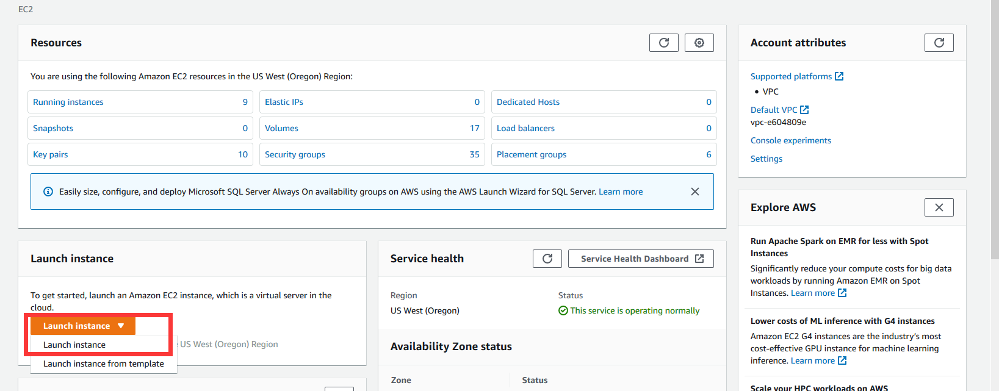

# Get Started with XGBoost4J-Spark 3.0 on AWS EC2

This is a getting started guide to Spark 3.0 on AWS EC2. At the end of this guide, the reader will be able to run a sample Apache Spark application that runs on NVIDIA GPUs on AWS EC2.

For more details of AWS EC2 and get started, please check the [AWS document](https://aws.amazon.com/ec2/getting-started/).

## Configure and Launch AWS EC2

Go to AWS Management Console select a region, e.g. Oregon, and click EC2 service.

### Step 1:  Launch New Instance

Click "Launch instance" at the EC2 Management Console, and select "Launch instance".



### Step 2:  Configure Instance

#### Step 2.1: Choose an Amazon Machine Image(AMI)

Search for "deep learning base ami", choose "Deep Learning Base AMI (Ubuntu 18.04)". Click "Select".


#### Step 2.2: Choose an Instance Type

Choose type "p3.2xlarge". Click "Next: Configure Instance Details" at right buttom.


#### Step 2.3: Configure Instance Detials

Do not need to change anything here, make sure "Number of instances" is 1. Click "Next: Add Storage" at right buttom.


#### Step 2.4: Add Storage

Change the root disk size based on your needed, also you can add ebs volume by clicking "Add New Volume". In this sample, we use default 50G. Click "Next: Add Tag" at right buttom.

For more details of AWS EBS please check the [AWS document](https://docs.aws.amazon.com/AWSEC2/latest/UserGuide/AmazonEBS.html).


#### Step 2.5: Add Tags

You can add tag here or skip. In this sample, we will skip it. Click "Next: Configure Security Group" at right buttom.

#### Step 2.6: Configure Security Group

For convenience, in this sample, we open all ports. You can add your own rules.

Create a new security group and select type as "All traffic". Click "Review and Launch" at right buttom.

For more details of security group, please check the [AWS document](https://docs.aws.amazon.com/AWSEC2/latest/UserGuide/ec2-security-groups.html).


#### Step 2.7: Review Instance Launch

Review your configuration. Click "Launch" at right buttom. Choose the key-pair you have and launch instances.

Return "instances | EC2 Managemnt Console", you can find your instance running. (It may take a few minutes to initialize)


## Launch EC2 and Configure Spark 3.0

### Step 1:  Launch EC2

Copy "Public DNS (IPv4)" of your instance 
Use ssh with your private key to launch the EC2 machine as user "ubuntu"

``` bash
ssh -i "key.pem" ubuntu@xxxx.region.compute.amazonaws.com
```

### Step 2: Download Spark package

Download spark package and set environment variable.

``` bash
# download the spark
wget https://downloads.apache.org/spark/spark-3.0.0/spark-3.0.0-bin-hadoop3.2.tgz
tar zxf spark-3.0.0-bin-hadoop3.2.tgz
export SPARK_HOME=/your/spark/spark-3.0.0-bin-hadoop3.2
```

### Step 3: Download jars for S3A (optional)

If your dataset is on S3, you should download below jar files to enable the accessing of S3. In this sample, we will use data on S3.
The jars should under $SPARK_HOME/jars

``` bash
cd $SPARK_HOME/jars
wget https://github.com/JodaOrg/joda-time/releases/download/v2.10.5/joda-time-2.10.5.jar
wget https://repo1.maven.org/maven2/org/apache/hadoop/hadoop-aws/3.2.0/hadoop-aws-3.2.0.jar
wget https://repo1.maven.org/maven2/com/amazonaws/aws-java-sdk/1.11.687/aws-java-sdk-1.11.687.jar
wget https://repo1.maven.org/maven2/com/amazonaws/aws-java-sdk-core/1.11.687/aws-java-sdk-core-1.11.687.jar
wget https://repo1.maven.org/maven2/com/amazonaws/aws-java-sdk-dynamodb/1.11.687/aws-java-sdk-dynamodb-1.11.687.jar
wget https://repo1.maven.org/maven2/com/amazonaws/aws-java-sdk-s3/1.11.687/aws-java-sdk-s3-1.11.687.jar
```

### Step 4: Start Spark Standalone

#### Step 4.1: Edit spark-defualt.conf

cd $SPARK_HOME/conf and edit spark-defaults.conf

By default, thers is only spark-defaults.conf.template in $SPARK_HOME/conf, you could edit it and rename to spark-defaults.conf
You can find getGpusResources.sh in $SPARK_HOME/examples/src/main/scripts/getGpusResources.sh

``` bash
spark.worker.resource.gpu.amount 1
spark.worker.resource.gpu.discoveryScript /path/to/getGpusResources.sh
```

The gpu.amount should be <= the number of GPUs the worker has.

#### Step 4.2: Start Spark Standalone

Start Spark. Default master-spark-URL is spark://$HOSTNAME:7077 . 

``` bash
$SPARK_HOME/sbin/start-master.sh
$SPARK_HOME/sbin/start-slave.sh <master-spark-URL>
```

## Launch XGBoost-Spark examples on Spark 3.0

### Step 1: Download Jars

Make sure you have prepared the necessary packages and dataset by following this [guide](/docs/get-started/xgboost-examples/prepare-package-data/preparation-scala.md)

Copy cudf and rapids jars to `$SPARK_HOME/jars`

``` bash
cp $CUDF_JAR $SPARK_HOME/jars/
cp $RAPIDS_JAR $SPARK_HOME/jars/
```

### Step 2: Create sample running script

Create running run.sh script with below content, make sure change the paths in it to your own. Also your aws key/secret.

``` bash
#!/bin/bash
export SPARK_HOME=/your/path/to/spark-3.0.0-bin-hadoop3.2

export PATH=$SPARK_HOME/bin:$SPARK_HOME/sbin:$PATH

export TOTAL_CORES=8
export NUM_EXECUTORS=1
export NUM_EXECUTOR_CORES=$((${TOTAL_CORES}/${NUM_EXECUTORS}))

export S3A_CREDS_USR=your_aws_key

export S3A_CREDS_PSW=your_aws_secret

spark-submit --master spark://$HOSTNAME:7077 \
        --deploy-mode client \
        --driver-memory 10G \
        --executor-memory 22G \
        --conf spark.hadoop.fs.s3a.impl=org.apache.hadoop.fs.s3a.S3AFileSystem \
        --conf spark.hadoop.fs.s3a.access.key=$S3A_CREDS_USR \
        --conf spark.hadoop.fs.s3a.secret.key=$S3A_CREDS_PSW \
        --conf spark.executor.memoryOverhead=28G \
        --conf spark.cores.max=$TOTAL_CORES \
        --conf spark.executor.cores=$NUM_EXECUTOR_CORES \
        --conf spark.task.cpus=$NUM_EXECUTOR_CORES \
        --conf spark.sql.files.maxPartitionBytes=4294967296 \
        --conf spark.yarn.maxAppAttempts=1 \
        --conf spark.plugins=com.nvidia.spark.SQLPlugin \
        --conf spark.rapids.memory.gpu.pooling.enabled=false \
        --conf spark.executor.resource.gpu.amount=1 \
        --conf spark.task.resource.gpu.amount=1 \
        --class com.nvidia.spark.examples.mortgage.GPUMain \
        ${SAMPLE_JAR} \
        -num_workers=${NUM_EXECUTORS} \
        -format=csv \
        -dataPath="train::s3a://spark-xgboost-mortgage-dataset/csv/train/2000Q1" \
        -dataPath="trans::s3a://spark-xgboost-mortgage-dataset/csv/eval/2000Q1" \
        -numRound=100 -max_depth=8 -nthread=$NUM_EXECUTOR_CORES -showFeatures=0 \
        -tree_method=gpu_hist
```

### Step 3: Submit Sample job

Run run.sh

``` bash
./run.sh
```

After running successfully, the job will print an accuracy benchmark for model prediction.  
