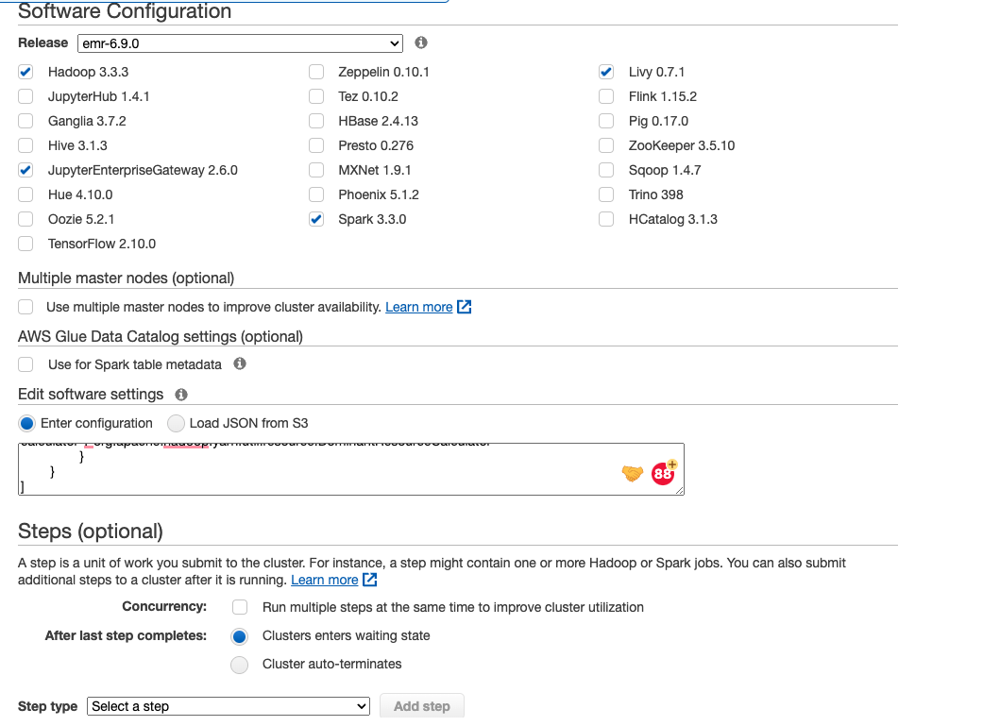
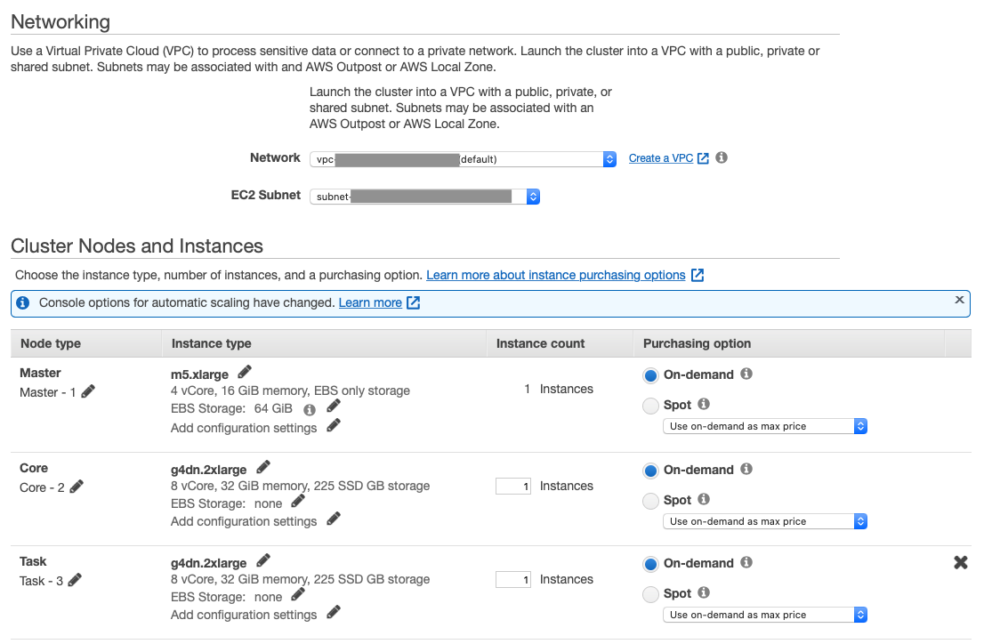
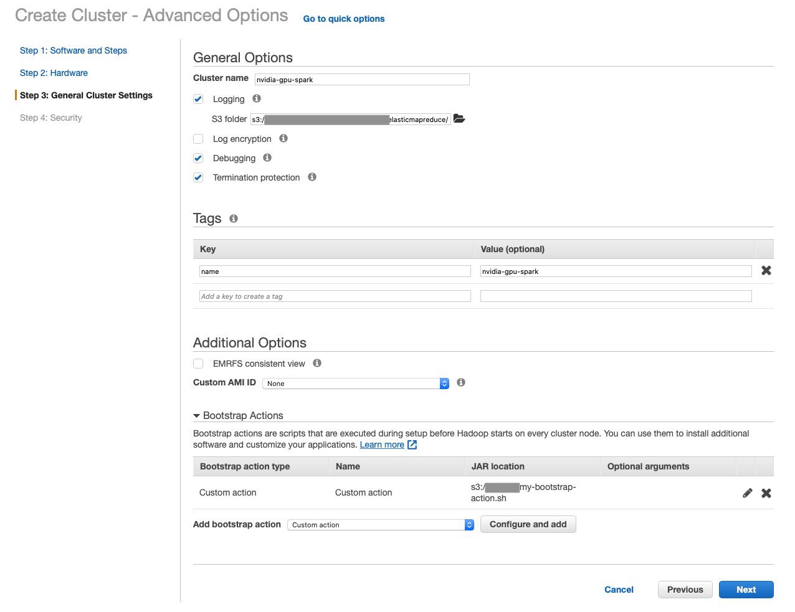
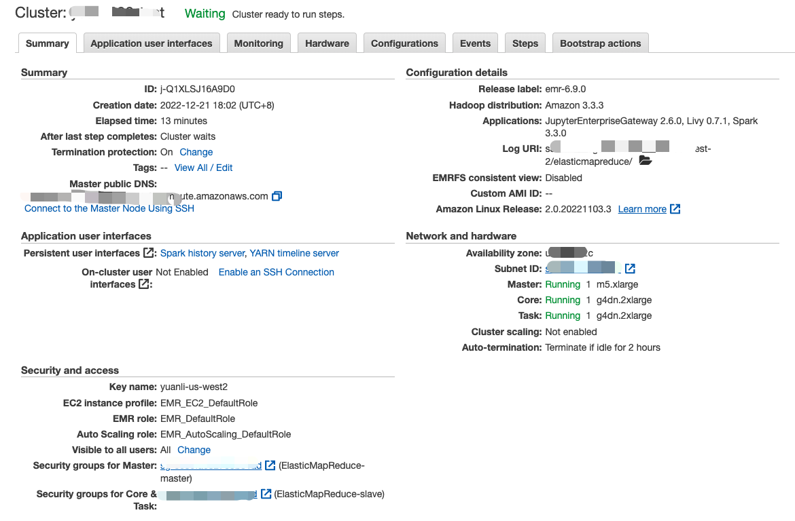

# Get Started with RAPIDS on AWS EMR

This is a getting started guide for the RAPIDS Accelerator for Apache Spark on AWS EMR. At the end
of this guide, the user will be able to run a sample Apache Spark application that runs on NVIDIA
GPUs on AWS EMR.

Different versions of EMR ship with different versions of Spark, RAPIDS Accelerator, cuDF and xgboost4j-spark:

| EMR | Spark | RAPIDS Accelerator jar | cuDF jar | xgboost4j-spark jar
| --- | --- | --- | ---| --- |
| 6.9 | 3.3.0 | rapids-4-spark_2.12-22.08.0.jar | Bundled with rapids-4-spark | xgboost4j-spark_3.0-1.4.2-0.3.0.jar |
| 6.8 | 3.3.0 | rapids-4-spark_2.12-22.06.0.jar | Bundled with rapids-4-spark | xgboost4j-spark_3.0-1.4.2-0.3.0.jar |
| 6.7 | 3.2.1 | rapids-4-spark_2.12-22.02.0.jar | cudf-22.02.0-cuda11.jar | xgboost4j-spark_3.0-1.2.0-0.1.0.jar |
| 6.6 | 3.2.0 | rapids-4-spark_2.12-22.02.0.jar | cudf-22.02.0-cuda11.jar | xgboost4j-spark_3.0-1.2.0-0.1.0.jar |
| 6.5 | 3.1.2 | rapids-4-spark_2.12-0.4.1.jar | cudf-0.18.1-cuda10-1.jar | xgboost4j-spark_3.0-1.2.0-0.1.0.jar |
| 6.4 | 3.1.2 | rapids-4-spark_2.12-0.4.1.jar | cudf-0.18.1-cuda10-1.jar | xgboost4j-spark_3.0-1.2.0-0.1.0.jar |
| 6.3 | 3.1.1 | rapids-4-spark_2.12-0.4.1.jar | cudf-0.18.1-cuda10-1.jar | xgboost4j-spark_3.0-1.2.0-0.1.0.jar |
| 6.2 | 3.0.1 | rapids-4-spark_2.12-0.2.0.jar | cudf-0.15-cuda10-1.jar | xgboost4j-spark_3.0-1.0.0-0.2.0.jar |

For more details of supported applications, please see the [EMR release
notes](https://docs.aws.amazon.com/emr/latest/ReleaseGuide/emr-release-6x.html).

For more information on AWS EMR, please see the [AWS
documentation](https://docs.aws.amazon.com/emr/latest/ManagementGuide/emr-what-is-emr.html).

## Configure and Launch AWS EMR with GPU Nodes

The following steps are based on the AWS EMR document ["Using the NVIDIA Spark-RAPIDS Accelerator
for Spark"](https://docs.aws.amazon.com/emr/latest/ReleaseGuide/emr-spark-rapids.html)

###  Launch an EMR Cluster using AWS CLI

You can use the AWS CLI to launch a cluster with one Master node (m5.xlarge) and two 
g4dn.2xlarge nodes: 

```
aws emr create-cluster \
--release-label emr-6.9.0 \
--applications Name=Hadoop Name=Spark Name=Livy Name=JupyterEnterpriseGateway \
--service-role EMR_DefaultRole \
--ec2-attributes KeyName=my-key-pair,InstanceProfile=EMR_EC2_DefaultRole \
--instance-groups InstanceGroupType=MASTER,InstanceCount=1,InstanceType=m4.4xlarge \
                  InstanceGroupType=CORE,InstanceCount=1,InstanceType=g4dn.2xlarge \
                  InstanceGroupType=TASK,InstanceCount=1,InstanceType=g4dn.2xlarge \
--configurations file:///my-configurations.json \
--bootstrap-actions Name='My Spark Rapids Bootstrap action',Path=s3://my-bucket/my-bootstrap-action.sh
```

Please fill with actual value for `KeyName` and file paths. You can further customize SubnetId,
EmrManagedSlaveSecurityGroup, EmrManagedMasterSecurityGroup, name and region etc. 

The `my-configurations.json` installs the spark-rapids plugin on your cluster, configures YARN to use

GPUs, configures Spark to use RAPIDS, and configures the YARN capacity scheduler.  An example JSON

configuration can be found in the section on launching in the GUI below. 

The `my-boostrap-action.sh` script referenced in the above script opens cgroup permissions to YARN
on your cluster.  This is required for YARN to use GPUs.  An example script is as follows: 
```bash
#!/bin/bash
 
set -ex
 
sudo chmod a+rwx -R /sys/fs/cgroup/cpu,cpuacct
sudo chmod a+rwx -R /sys/fs/cgroup/devices
```

###  Launch an EMR Cluster using AWS Console (GUI)

Go to the AWS Management Console and select the `EMR` service from the "Analytics" section. Choose
the region you want to launch your cluster in, e.g. US West (Oregon), using the dropdown menu in the
top right corner. Click `Create cluster` and select `Go to advanced options`, which will bring up a
detailed cluster configuration page.

#### Step 1:  Software Configuration and Steps

Select **emr-6.9.0** for the release, uncheck all the software options, and then check **Hadoop
3.3.3**, **Spark 3.3.0**, **Livy 0.7.1** and **JupyterEnterpriseGateway 2.6.0**.

In the "Edit software settings" field, copy and paste the configuration from the [EMR
document](https://docs.aws.amazon.com/emr/latest/ReleaseGuide/emr-spark-rapids.html). You can also
create a JSON file on you own S3 bucket. 

For clusters with 2x g4dn.2xlarge GPU instances as worker nodes, we recommend the following
default settings: 
```json
[
	{
		"Classification":"spark",
		"Properties":{
			"enableSparkRapids":"true"
		}
	},
	{
		"Classification":"yarn-site",
		"Properties":{
			"yarn.nodemanager.resource-plugins":"yarn.io/gpu",
			"yarn.resource-types":"yarn.io/gpu",
			"yarn.nodemanager.resource-plugins.gpu.allowed-gpu-devices":"auto",
			"yarn.nodemanager.resource-plugins.gpu.path-to-discovery-executables":"/usr/bin",
			"yarn.nodemanager.linux-container-executor.cgroups.mount":"true",
			"yarn.nodemanager.linux-container-executor.cgroups.mount-path":"/sys/fs/cgroup",
			"yarn.nodemanager.linux-container-executor.cgroups.hierarchy":"yarn",
			"yarn.nodemanager.container-executor.class":"org.apache.hadoop.yarn.server.nodemanager.LinuxContainerExecutor"
		}
	},
	{
		"Classification":"container-executor",
		"Properties":{
			
		},
		"Configurations":[
			{
				"Classification":"gpu",
				"Properties":{
					"module.enabled":"true"
				}
			},
			{
				"Classification":"cgroups",
				"Properties":{
					"root":"/sys/fs/cgroup",
					"yarn-hierarchy":"yarn"
				}
			}
		]
	},
	{
        "Classification":"spark-defaults",
        "Properties":{
        "spark.plugins":"com.nvidia.spark.SQLPlugin",
        "spark.sql.sources.useV1SourceList":"",
        "spark.executor.resource.gpu.discoveryScript":"/usr/lib/spark/scripts/gpu/getGpusResources.sh",
        "spark.submit.pyFiles":"/usr/lib/spark/jars/xgboost4j-spark_3.0-1.4.2-0.3.0.jar",
        "spark.executor.extraLibraryPath":"/usr/local/cuda/targets/x86_64-linux/lib:/usr/local/cuda/extras/CUPTI/lib64:/usr/local/cuda/compat/lib:/usr/local/cuda/lib:/usr/local/cuda/lib64:/usr/lib/hadoop/lib/native:/usr/lib/hadoop-lzo/lib/native:/docker/usr/lib/hadoop/lib/native:/docker/usr/lib/hadoop-lzo/lib/native",
        "spark.rapids.sql.concurrentGpuTasks":"2",
        "spark.executor.resource.gpu.amount":"1",
        "spark.executor.cores":"8",
        "spark.task.cpus ":"1",
        "spark.task.resource.gpu.amount":"0.125",
        "spark.rapids.memory.pinnedPool.size":"2G",
        "spark.executor.memoryOverhead":"2G",
        "spark.sql.files.maxPartitionBytes":"256m",
        "spark.sql.adaptive.enabled":"false"
        }
	},
	{
		"Classification":"capacity-scheduler",
		"Properties":{
			"yarn.scheduler.capacity.resource-calculator":"org.apache.hadoop.yarn.util.resource.DominantResourceCalculator"
		}
	}
]

```
Adjust the settings as appropriate for your cluster.  For example, setting the appropriate
number of cores based on the node type.  The `spark.task.resource.gpu.amount` should be set to
1/(number of cores per executor) which will allow multiple tasks to run in parallel on the GPU. 

For example, for clusters with 2x g4dn.12xlarge as core nodes, use the following: 

```json
        "spark.executor.cores":"12",
        "spark.task.resource.gpu.amount":"0.0833",
```

More configuration details can be found in the [configuration](../configs.md) documentation. 



#### Step 2: Hardware

Select the desired VPC and availability zone in the "Network" and "EC2 Subnet" fields
respectively. (Default network and subnet are ok)

In the "Core" node row, change the "Instance type" to **g4dn.xlarge**, **g4dn.2xlarge**, or
**p3.2xlarge** and ensure "Instance count" is set to **1** or any higher number. Keep the default
"Master" node instance type of **m5.xlarge**.



#### Step 3:  General Cluster Settings

Enter a custom "Cluster name" and make a note of the s3 folder that cluster logs will be written to.

Add a custom "Bootstrap Actions" to allow cgroup permissions to YARN on your cluster.  An example
bootstrap script is as follows: 
```bash
#!/bin/bash
 
set -ex
 
sudo chmod a+rwx -R /sys/fs/cgroup/cpu,cpuacct
sudo chmod a+rwx -R /sys/fs/cgroup/devices
```

*Optionally* add key-value "Tags", configure a "Custom AMI" for the EMR cluster on this page.



####  Step 4: Security

Select an existing "EC2 key pair" that will be used to authenticate SSH access to the cluster's
nodes. If you do not have access to an EC2 key pair, follow these instructions to [create an EC2 key
pair](https://docs.aws.amazon.com/AWSEC2/latest/UserGuide/ec2-key-pairs.html#having-ec2-create-your-key-pair).

*Optionally* set custom security groups in the "EC2 security groups" tab.

In the "EC2 security groups" tab, confirm that the security group chosen for the "Master" node
allows for SSH access. Follow these instructions to [allow inbound SSH
traffic](https://docs.aws.amazon.com/AWSEC2/latest/UserGuide/authorizing-access-to-an-instance.html)
if the security group does not allow it yet.


#### Finish Cluster Configuration

The EMR cluster management page displays the status of multiple clusters or detailed information
about a chosen cluster. In the detailed cluster view, the "Summary" and "Hardware" tabs can be used
to monitor the status of master and core nodes as they provision and initialize.

When the cluster is ready, a green-dot will appear next to the cluster name and the "Status" column
will display **Waiting, cluster ready**.

In the cluster's "Summary" tab, find the "Master public DNS" field and click the `SSH`
button. Follow the instructions to SSH to the new cluster's master node.



### Build and Execute XGBoost-Spark examples on EMR
Install git and maven

SSH to the EMR cluster's master node and run the following steps to setup, build, and run the XGBoost-Spark examples.

#### Install git and maven

```
sudo yum update -y

# install git 
sudo yum install git -y

# install maven 
wget https://downloads.apache.org/maven/maven-3/3.6.3/binaries/apache-maven-3.6.3-bin.tar.gz -P /tmp
sudo tar -xzvf /tmp/apache-maven-3.6.3-bin.tar.gz -C /opt
sudo ln -s /opt/apache-maven-3.6.3 /opt/maven

# sudo vi /etc/profile.d/maven.sh
export JAVA_HOME=/usr/lib/jvm/jre-openjdk
export M2_HOME=/opt/maven
export MAVEN_HOME=/opt/maven
export PATH=${M2_HOME}/bin:${PATH}
source /etc/profile.d/maven.sh
```

#### Build Example Jars and Preparing the dataset
Following this [guide](/docs/get-started/xgboost-examples/prepare-package-data/preparation-scala.md) to build the jar and download the dataset.

#### Upload Data files to HDFS
```
# take mortgage dataset as an example
hadoop fs -put mortgage /user/
```

#### Remove the legacy jars
```
# bash into the master node and remove legacy jars
cd /usr/lib/spark/jars/
sudo rm -rf xgboost4j*
```

#### Launch the GPU Mortgage Example
```
# location where data was downloaded
export DATA_PATH=/user/mortgage
# location for the required jar
# spark deploy mode (see Apache Spark documentation for more information)
export SPARK_DEPLOY_MODE=client
# run a single executor for this example to limit the number of spark tasks and
# partitions to 1 as currently this number must match the number of input files
export SPARK_NUM_EXECUTORS=1
# spark driver memory
export SPARK_DRIVER_MEMORY=2g
# spark executor memory
export SPARK_EXECUTOR_MEMORY=2g
# example class to use
export EXAMPLE_CLASS=com.nvidia.spark.examples.mortgage.Main
# XGBoost4J example jar
export JAR_EXAMPLE=/home/hadoop/sample_xgboost_apps-0.2.3-SNAPSHOT-jar-with-dependencies.jar
# tree construction algorithm
export TREE_METHOD=gpu_hist
 
spark-submit                                                                    \
 --master yarn                                                                  \
 --deploy-mode ${SPARK_DEPLOY_MODE}                                             \
 --num-executors ${SPARK_NUM_EXECUTORS}                                         \
 --driver-memory ${SPARK_DRIVER_MEMORY}                                         \
 --executor-memory ${SPARK_EXECUTOR_MEMORY}                                     \
 --conf spark.executor.cores=2         \
 --conf spark.dynamicAllocation.enabled=false \
 --conf spark.executor.resource.gpu.amount=1 \
 --conf spark.task.resource.gpu.amount=0.5 \
 --conf spark.rapids.sql.concurrentGpuTasks=1 \
 --class ${EXAMPLE_CLASS}                                                       \
 ${JAR_EXAMPLE}                                                                 \
 -dataPath=train::${DATA_PATH}/parquet/train/       \
 -dataPath=trans::${DATA_PATH}/parquet/eval/          \
 -format=parquet                                                                    \
 -numWorkers=${SPARK_NUM_EXECUTORS}                                             \
 -treeMethod=${TREE_METHOD}                                                     \
 -numRound=100                                                                  \
 -maxDepth=8  \
 -allow_non_zero_for_missing=true
```

#### Review the results
If using the client mode for spark deploy, you can view the results directly from master node. 
For example, the terminal output on master node has following lines for the benchmark using two g4dn.2xlarge instances.

```
......

2023-02-01 06:24:24,279 INFO scheduler.DAGScheduler: Job 7 finished: show at Main.scala:90, took 0.116612 s
2023-02-01 06:24:24,315 INFO codegen.CodeGenerator: Code generated in 25.369402 ms
+------------+----------------+------------+-------------+----------------+--------------+------------+-----------------------------+-----------+--------+------------------+--------+--------------+--------+---------+-------------+----+---------------------+---------+---+--------------------------+-------------------------------+------------------+-------------+--------+-------+------------------------+--------------+--------------------+--------------------+----------+
|orig_channel|first_home_buyer|loan_purpose|property_type|occupancy_status|property_state|product_type|relocation_mortgage_indicator|seller_name|mod_flag|orig_interest_rate|orig_upb|orig_loan_term|orig_ltv|orig_cltv|num_borrowers| dti|borrower_credit_score|num_units|zip|mortgage_insurance_percent|current_loan_delinquency_status|current_actual_upb|interest_rate|loan_age|    msa|non_interest_bearing_upb|delinquency_12|       rawPrediction|         probability|prediction|
+------------+----------------+------------+-------------+----------------+--------------+------------+-----------------------------+-----------+--------+------------------+--------+--------------+--------+---------+-------------+----+---------------------+---------+---+--------------------------+-------------------------------+------------------+-------------+--------+-------+------------------------+--------------+--------------------+--------------------+----------+
|         0.0|             0.0|         0.0|          0.0|             0.0|           0.0|         0.0|                          0.0|        0.0|     0.0|              4.25|   96000|           180|    64.0|     64.0|          1.0|54.0|                768.0|        1|  9|                       0.0|                              0|               0.0|         4.25|     0.0|41980.0|                     0.0|             0|[15.6395120620727...|[0.99999983862132...|       0.0|
|         0.0|             0.0|         0.0|          0.0|             0.0|           0.0|         0.0|                          0.0|        0.0|     0.0|              4.25|   96000|           180|    64.0|     64.0|          1.0|54.0|                768.0|        1|  9|                       0.0|                              0|               0.0|         4.25|     1.0|41980.0|                     0.0|             0|[15.0541849136352...|[0.99999971023200...|       0.0|
|         0.0|             0.0|         0.0|          0.0|             0.0|           0.0|         0.0|                          0.0|        0.0|     0.0|              4.25|   96000|           180|    64.0|     64.0|          1.0|54.0|                768.0|        1|  9|                       0.0|                              0|               0.0|         4.25|     3.0|41980.0|                     0.0|             0|[14.1502227783203...|[0.99999928445652...|       0.0|
|         0.0|             0.0|         0.0|          0.0|             0.0|           0.0|         0.0|                          0.0|        0.0|     0.0|              4.25|   96000|           180|    64.0|     64.0|          1.0|54.0|                768.0|        1|  9|                       0.0|                              0|               0.0|         4.25|     4.0|41980.0|                     0.0|             0|[14.1266565322875...|[0.99999926739360...|       0.0|
|         0.0|             0.0|         0.0|          0.0|             0.0|           0.0|         0.0|                          0.0|        0.0|     0.0|              4.25|   96000|           180|    64.0|     64.0|          1.0|54.0|                768.0|        1|  9|                       0.0|                              0|               0.0|         4.25|     5.0|41980.0|                     0.0|             0|[13.3200092315673...|[0.99999835868175...|       0.0|
+------------+----------------+------------+-------------+----------------+--------------+------------+-----------------------------+-----------+--------+------------------+--------+--------------+--------+---------+-------------+----+---------------------+---------+---+--------------------------+-------------------------------+------------------+-------------+--------+-------+------------------------+--------------+--------------------+--------------------+----------+
only showing top 5 rows


------Accuracy of Evaluation------
2023-02-01 06:24:24,377 WARN rapids.GpuOverrides:

......

2023-02-01 06:24:24,655 INFO scheduler.TaskSchedulerImpl: Killing all running tasks in stage 11: Stage finished
2023-02-01 06:24:24,655 INFO scheduler.DAGScheduler: Job 8 finished: collectAsMap at MulticlassMetrics.scala:61, took 0.219596 s

--------------
==> Benchmark: Accuracy for [Mortgage Mai Accuracy parquet stub Unknown Unknown Unknown]: 0.9999
--------------
```