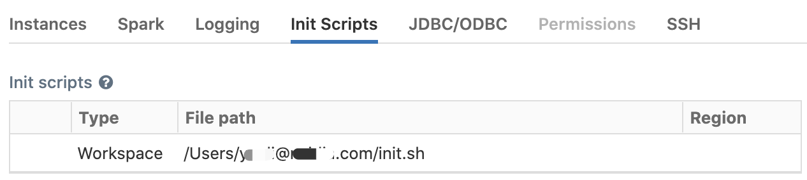
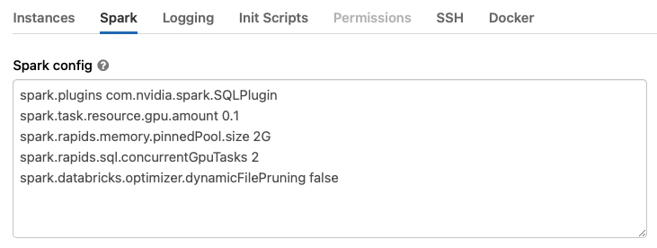

Get Started with XGBoost4J-Spark on Databricks
======================================================

This is a getting started guide to XGBoost4J-Spark on Databricks. At the end of this guide, the reader will be able to run a sample Apache Spark application that runs on NVIDIA GPUs on Databricks.

Prerequisites
-------------

    * Apache Spark 3.x running in Databricks Runtime 10.4 ML or 11.3 ML with GPU
    * AWS: 10.4 LTS ML (GPU, Scala 2.12, Spark 3.2.1) or 11.3 LTS ML (GPU, Scala 2.12, Spark 3.3.0)
    * Azure: 10.4 LTS ML (GPU, Scala 2.12, Spark 3.2.1) or 11.3 LTS ML (GPU, Scala 2.12, Spark 3.3.0)

The number of GPUs per node dictates the number of Spark executors that can run in that node. Each executor should only be allowed to run 1 task at any given time.
   
Start A Databricks Cluster
--------------------------
Before creating the cluster, we will need to create an [initialization script](https://docs.databricks.com/clusters/init-scripts.html) for the 
cluster to install the RAPIDS jars. Databricks recommends storing all cluster-scoped init scripts using workspace files. 
Each user has a Home directory configured under the /Users directory in the workspace. 
Navigate to your home directory in the UI and select **Create** > **File** from the menu, 
create an `init.sh` scripts with contents:   
   ```bash
   #!/bin/bash
   sudo wget -O /databricks/jars/rapids-4-spark_2.12-25.10.0.jar https://repo1.maven.org/maven2/com/nvidia/rapids-4-spark_2.12/25.10.0/rapids-4-spark_2.12-25.10.0.jar
   ```
1. Select the Databricks Runtime Version from one of the supported runtimes specified in the
   Prerequisites section.
2. Choose the number of workers that matches the number of GPUs you want to use.
3. Select a worker type. On AWS, use nodes with 1 GPU each such as `p3.2xlarge` or `g4dn.xlarge`.
   For Azure, choose GPU nodes such as Standard_NC6s_v3. For GCP, choose N1 or A2 instance types with GPUs. 
4. Select the driver type. Generally this can be set to be the same as the worker.
5. Click the “Edit” button, then navigate down to the “Advanced Options” section. Select the “Init Scripts” tab in 
   the advanced options section, and paste the workspace path to the initialization script:`/Users/user@domain/init.sh`, then click “Add”.
   
6. Now select the “Spark” tab, and paste the following config options into the Spark Config section.
   Change the config values based on the workers you choose. See Apache Spark
   [configuration](https://spark.apache.org/docs/latest/configuration.html) and RAPIDS Accelerator
   for Apache Spark [descriptions](https://nvidia.github.io/spark-rapids/docs/configs.html) for each config.

    The
    [`spark.task.resource.gpu.amount`](https://spark.apache.org/docs/latest/configuration.html#scheduling)
    configuration is defaulted to 1 by Databricks. That means that only 1 task can run on an
    executor with 1 GPU, which is limiting, especially on the reads and writes from Parquet. Set
    this to 1/(number of cores per executor) which will allow multiple tasks to run in parallel just
    like the CPU side. Having the value smaller is fine as well.
    Note: Please remove the `spark.task.resource.gpu.amount` config for a single-node Databricks 
    cluster because Spark local mode does not support GPU scheduling.
   
    ```bash
    spark.plugins com.nvidia.spark.SQLPlugin
    spark.task.resource.gpu.amount 0.1
    spark.rapids.memory.pinnedPool.size 2G
    spark.rapids.sql.concurrentGpuTasks 2
    ```

    

    If running Pandas UDFs with GPU support from the plugin, at least three additional options
    as below are required. The `spark.python.daemon.module` option is to choose the right daemon module
    of python for Databricks. On Databricks, the python runtime requires different parameters than the
    Spark one, so a dedicated python demon module `rapids.daemon_databricks` is created and should
    be specified here. Set the config
    [`spark.rapids.sql.python.gpu.enabled`](https://nvidia.github.io/spark-rapids/docs/configs.html#sql.python.gpu.enabled) to `true` to
    enable GPU support for python. Add the path of the plugin jar (supposing it is placed under
    `/databricks/jars/`) to the `spark.executorEnv.PYTHONPATH` option. For more details please go to
    [GPU Scheduling For Pandas UDF](https://nvidia.github.io/spark-rapids/docs/additional-functionality/rapids-udfs.html#gpu-support-for-pandas-udf)

    ```bash
    spark.rapids.sql.python.gpu.enabled true
    spark.python.daemon.module rapids.daemon_databricks
    spark.executorEnv.PYTHONPATH /databricks/jars/rapids-4-spark_2.12-25.10.0.jar:/databricks/spark/python
    ```
   Note that since python memory pool require installing the cudf library, so you need to install cudf library in 
   each worker nodes `pip install cudf-cu11 --extra-index-url=https://pypi.nvidia.com` or disable python memory pool
   `spark.rapids.python.memory.gpu.pooling.enabled=false`.
   
7. Click `Create Cluster`, it is now enabled for GPU-accelerated Spark.

Install the xgboost4j_spark jar in the cluster
---------------------------

1. See [Libraries](https://docs.databricks.com/user-guide/libraries.html) for how to install jars from DBFS
2. Go to "Libraries" tab under your cluster and install dbfs:/FileStore/jars/${XGBOOST4J_SPARK_JAR} in your cluster by selecting the "DBFS" option for installing jars

These steps will ensure you are able to import xgboost libraries in python notebooks.

Import the GPU Mortgage Example Notebook
---------------------------

1. See [Managing Notebooks](https://docs.databricks.com/user-guide/notebooks/notebook-manage.html) on how to import a notebook.
2. Import the example notebook: [XGBoost4j-Spark mortgage notebook](../../../../../examples/XGBoost-Examples/mortgage/notebooks/scala/mortgage-gpu.ipynb)
3. Inside the mortgage example notebook, update the data paths from 
"/data/datasets/mortgage-small/train" to "dbfs:/FileStore/tables/mortgage/csv/train/mortgage_train_merged.csv"
"/data/datasets/mortgage-small/eval" to "dbfs:/FileStore/tables/mortgage/csv/test/mortgage_eval_merged.csv"

The example notebook comes with the following configuration, you can adjust this according to your setup.
See supported configuration options here: [xgboost parameters](../../../../../examples/XGBoost-Examples/app-parameters/supported_xgboost_parameters_python.md)

``` bash
params = { 
    'eta': 0.1,
    'gamma': 0.1,
    'missing': 0.0,
    'treeMethod': 'gpu_hist',
    'maxDepth': 10, 
    'maxLeaves': 256,
    'growPolicy': 'depthwise',
    'minChildWeight': 30.0,
    'lambda_': 1.0,
    'scalePosWeight': 2.0,
    'subsample': 1.0,
    'nthread': 1,
    'numRound': 100,
    'numWorkers': 1,
}
```

4. Run all the cells in the notebook.

5. View the results
In the cell 5 (Training), 7 (Transforming) and 8 (Accuracy of Evaluation) you will see the output.

```
--------------
==> Benchmark: 
Training takes 6.48 seconds
--------------

--------------
==> Benchmark: Transformation takes 3.2 seconds

--------------

------Accuracy of Evaluation------
Accuracy is 0.9980699597729774

```

Limitations
-------------

1. When selecting GPU nodes, Databricks UI requires the driver node to be a GPU node. However you 
   can use Databricks API to create a cluster with CPU driver node.
   Outside of Databricks the plugin can operate with the driver as a CPU node and workers as GPU nodes.

2. Cannot spin off multiple executors on a multi-GPU node. 

   Even though it is possible to set `spark.executor.resource.gpu.amount=1` in the in Spark 
   Configuration tab, Databricks overrides this to `spark.executor.resource.gpu.amount=N` 
   (where N is the number of GPUs per node). This will result in failed executors when starting the
   cluster.

3. Parquet rebase mode is set to "LEGACY" by default.

   The following Spark configurations are set to `LEGACY` by default on Databricks:
   
   ```
   spark.sql.legacy.parquet.datetimeRebaseModeInWrite
   spark.sql.legacy.parquet.int96RebaseModeInWrite
   ```
   
   These settings will cause a CPU fallback for Parquet writes involving dates and timestamps.
   If you do not need `LEGACY` write semantics, set these configs to `EXCEPTION` which is
   the default value in Apache Spark 3.0 and higher.

4. Databricks makes changes to the runtime without notification.

    Databricks makes changes to existing runtimes, applying patches, without notification.
    [Issue-3098](https://github.com/NVIDIA/spark-rapids/issues/3098) is one example of this.  We run
    regular integration tests on the Databricks environment to catch these issues and fix them once
    detected.
   
5. In Databricks 11.3, an incorrect result is returned for window frames defined by a range in case 
   of DecimalTypes with precision greater than 38. There is a bug filed in Apache Spark for it 
   [here](https://issues.apache.org/jira/browse/SPARK-41793), whereas when using the plugin the 
   correct result will be returned.