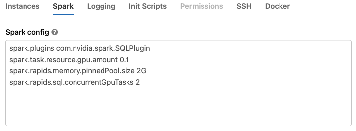

Get Started with XGBoost4J-Spark on Databricks
======================================================

This is a getting started guide to XGBoost4J-Spark on Databricks. At the end of this guide, the reader will be able to run a sample Apache Spark application that runs on NVIDIA GPUs on Databricks.

Prerequisites
-------------

    * Apache Spark 3.x running in Databricks Runtime 9.1 ML, 10.4 ML or 11.3 ML with GPU
    * AWS: 9.1 LTS ML (GPU, Scala 2.12, Spark 3.1.2), 10.4 LTS ML (GPU, Scala 2.12, Spark 3.2.1) or 11.3 LTS ML (GPU, Scala 2.12, Spark 3.3.0)
    * Azure: 9.1 LTS ML (GPU, Scala 2.12, Spark 3.1.2) or 10.4 LTS ML (GPU, Scala 2.12, Spark 3.2.1) or 11.3 LTS ML (GPU, Scala 2.12, Spark 3.3.0)

The number of GPUs per node dictates the number of Spark executors that can run in that node. Each executor should only be allowed to run 1 task at any given time.
   
Start A Databricks Cluster
--------------------------

Create a Databricks cluster by going to "Compute", then clicking `+ Create compute`.  Ensure the
cluster meets the prerequisites above by configuring it as follows:
1. Select the Databricks Runtime Version from one of the supported runtimes specified in the
   Prerequisites section.
2. Choose the number of workers that matches the number of GPUs you want to use.
3. Select a worker type. On AWS, use nodes with 1 GPU each such as `p3.2xlarge` or `g4dn.xlarge`.
   p2 nodes do not meet the architecture requirements (Pascal or higher) for the Spark worker
   (although they can be used for the driver node).  For Azure, choose GPU nodes such as
   Standard_NC6s_v3. For GCP, choose N1 or A2 instance types with GPUs. 
4. Select the driver type. Generally this can be set to be the same as the worker.
5. Start the cluster.

Advanced Cluster Configuration
--------------------------

We will need to create an initialization script for the cluster that installs the RAPIDS jars to the
cluster.

1. To create the initialization script, import the initialization script notebook from the repo to
   your workspace.  See [Managing
   Notebooks](https://docs.databricks.com/notebooks/notebooks-manage.html#id2) for instructions on
   how to import a notebook.  
   Select the initialization script based on the Databricks runtime
   version:
   
    - [Databricks 9.1 LTS
    ML](https://docs.databricks.com/release-notes/runtime/9.1ml.html#system-environment) has CUDA 11
    installed.  Users will need to use 21.12.0 or later on Databricks 9.1 LTS ML. In this case use
    [generate-init-script.ipynb](generate-init-script.ipynb) which will install
    the RAPIDS Spark plugin.
      
    - [Databricks 10.4 LTS
    ML](https://docs.databricks.com/release-notes/runtime/9.1ml.html#system-environment) has CUDA 11
    installed.  Users will need to use 22.04.0 or later on Databricks 10.4 LTS ML. In this case use
    [generate-init-script-10.4.ipynb](generate-init-script-10.4.ipynb) which will install
    the RAPIDS Spark plugin.
      
    - [Databricks 11.3 LTS
    ML](https://docs.databricks.com/release-notes/runtime/11.3ml.html#system-environment) has CUDA 11
    installed.  Users will need to use 23.04.0 or later on Databricks 11.3 LTS ML. In this case use
    [generate-init-script-11.3.ipynb](generate-init-script-11.3.ipynb) which will install
    the RAPIDS Spark plugin.
      
2. Once you are in the notebook, click the “Run All” button.
3. Ensure that the newly created init.sh script is present in the output from cell 2 and that the
   contents of the script are correct.
4. Go back and edit your cluster to configure it to use the init script.  To do this, click the
   “Compute” button on the left panel, then select your cluster.
5. Click the “Edit” button, then navigate down to the “Advanced Options” section.  Select the “Init
   Scripts” tab in the advanced options section, and paste the initialization script:
   `dbfs:/databricks/init_scripts/init.sh`, then click “Add”.

    

6. Now select the “Spark” tab, and paste the following config options into the Spark Config section.
   Change the config values based on the workers you choose.  See Apache Spark
   [configuration](https://spark.apache.org/docs/latest/configuration.html) and RAPIDS Accelerator
   for Apache Spark [descriptions](https://nvidia.github.io/spark-rapids/docs/configs.html) for each config.

    The
    [`spark.task.resource.gpu.amount`](https://spark.apache.org/docs/latest/configuration.html#scheduling)
    configuration is defaulted to 1 by Databricks. That means that only 1 task can run on an
    executor with 1 GPU, which is limiting, especially on the reads and writes from Parquet.  Set
    this to 1/(number of cores per executor) which will allow multiple tasks to run in parallel just
    like the CPU side.  Having the value smaller is fine as well.

	There is an incompatibility between the Databricks specific implementation of adaptive query
    execution (AQE) and the spark-rapids plugin.  In order to mitigate this,
    `spark.sql.adaptive.enabled` should be set to false.  In addition, the plugin does not work with
    the Databricks `spark.databricks.delta.optimizeWrite` option.

    ```bash
     spark.plugins com.nvidia.spark.SQLPlugin
     spark.task.resource.gpu.amount 0.1
     spark.rapids.memory.pinnedPool.size 2G
     spark.rapids.sql.concurrentGpuTasks 2
     spark.databricks.optimizer.dynamicFilePruning false
    ```

    

7. Once you’ve added the Spark config, click “Confirm and Restart”.
8. Once the cluster comes back up, it is now enabled for GPU-accelerated Spark with RAPIDS and cuDF.

Install the xgboost4j_spark jar in the cluster
---------------------------

1. See [Libraries](https://docs.databricks.com/user-guide/libraries.html) for how to install jars from DBFS
2. Go to "Libraries" tab under your cluster and install dbfs:/FileStore/jars/${XGBOOST4J_SPARK_JAR} in your cluster by selecting the "DBFS" option for installing jars

These steps will ensure you are able to import xgboost libraries in python notebooks.

Import the GPU Mortgage Example Notebook
---------------------------

1. See [Managing Notebooks](https://docs.databricks.com/user-guide/notebooks/notebook-manage.html) on how to import a notebook.
2. Import the example notebook: [XGBoost4j-Spark mortgage notebook](../../../../../examples/XGBoost-Examples/mortgage/notebooks/scala/mortgage-gpu.ipynb)
3. Inside the mortgage example notebook, update the data paths from 
"/data/datasets/mortgage-small/train" to "dbfs:/FileStore/tables/mortgage/csv/train/mortgage_train_merged.csv"
"/data/datasets/mortgage-small/eval" to "dbfs:/FileStore/tables/mortgage/csv/test/mortgage_eval_merged.csv"

The example notebook comes with the following configuration, you can adjust this according to your setup.
See supported configuration options here: [xgboost parameters](../../../../../examples/XGBoost-Examples/app-parameters/supported_xgboost_parameters_python.md)

``` bash
params = { 
    'eta': 0.1,
    'gamma': 0.1,
    'missing': 0.0,
    'treeMethod': 'gpu_hist',
    'maxDepth': 10, 
    'maxLeaves': 256,
    'growPolicy': 'depthwise',
    'minChildWeight': 30.0,
    'lambda_': 1.0,
    'scalePosWeight': 2.0,
    'subsample': 1.0,
    'nthread': 1,
    'numRound': 100,
    'numWorkers': 1,
}
```

4. Run all the cells in the notebook.

5. View the results
In the cell 5 (Training), 7 (Transforming) and 8 (Accuracy of Evaluation) you will see the output.

```
--------------
==> Benchmark: 
Training takes 6.48 seconds
--------------

--------------
==> Benchmark: Transformation takes 3.2 seconds

--------------

------Accuracy of Evaluation------
Accuracy is 0.9980699597729774

```

Limitations
-------------

1. When selecting GPU nodes, Databricks UI requires the driver node to be a GPU node. However you 
   can use Databricks API to create a cluster with CPU driver node.
   Outside of Databricks the plugin can operate with the driver as a CPU node and workers as GPU nodes.

2. Cannot spin off multiple executors on a multi-GPU node. 

   Even though it is possible to set `spark.executor.resource.gpu.amount=1` in the in Spark 
   Configuration tab, Databricks overrides this to `spark.executor.resource.gpu.amount=N` 
   (where N is the number of GPUs per node). This will result in failed executors when starting the
   cluster.

3. Parquet rebase mode is set to "LEGACY" by default.

   The following Spark configurations are set to `LEGACY` by default on Databricks:
   
   ```
   spark.sql.legacy.parquet.datetimeRebaseModeInWrite
   spark.sql.legacy.parquet.int96RebaseModeInWrite
   ```
   
   These settings will cause a CPU fallback for Parquet writes involving dates and timestamps.
   If you do not need `LEGACY` write semantics, set these configs to `EXCEPTION` which is
   the default value in Apache Spark 3.0 and higher.

4. Databricks makes changes to the runtime without notification.

    Databricks makes changes to existing runtimes, applying patches, without notification.
    [Issue-3098](https://github.com/NVIDIA/spark-rapids/issues/3098) is one example of this.  We run
    regular integration tests on the Databricks environment to catch these issues and fix them once
    detected.
   
5. In Databricks 11.3, an incorrect result is returned for window frames defined by a range in case 
   of DecimalTypes with precision greater than 38. There is a bug filed in Apache Spark for it 
   [here](https://issues.apache.org/jira/browse/SPARK-41793), whereas when using the plugin the 
   correct result will be returned.

6. A query may fail when Dynamic File Pruning is enabled. As a workaround, please
   disable the feature by setting `spark.databricks.optimizer.dynamicFilePruning false`. More details
   are in [issue-7648](https://github.com/NVIDIA/spark-rapids/issues/7648).