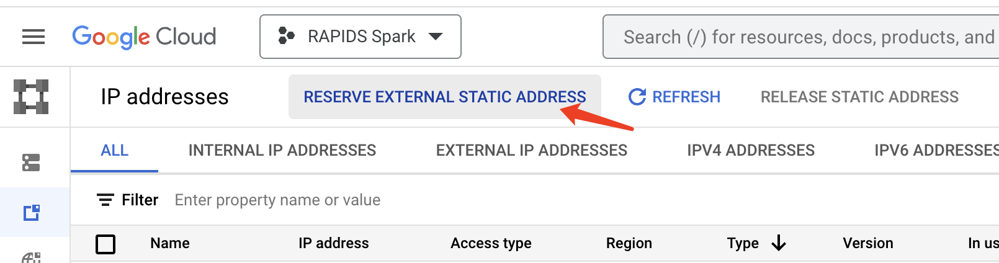

# Getting started pyspark+xgboost with RAPIDS Accelerator on GCP Dataproc
 [Google Cloud Dataproc](https://cloud.google.com/dataproc) is Google Cloud's fully managed Apache
 Spark and Hadoop service. Please make sure to install gcloud CLI by following 
 this [guide](https://cloud.google.com/sdk/docs/install) before getting started.
 
## Create a Dataproc Cluster using T4's
* One 16-core master node and 2 32-core worker nodes
* Two NVIDIA T4 for each worker node

```bash
    export REGION=[Your Preferred GCP Region]
    export GCS_BUCKET=[Your GCS Bucket]
    export CLUSTER_NAME=[Your Cluster Name]
    export NUM_GPUS=2
    export NUM_WORKERS=2

gcloud dataproc clusters create $CLUSTER_NAME  \
    --region=$REGION \
    --image-version=2.0-ubuntu18 \
    --master-machine-type=n2-standard-16 \
    --num-workers=$NUM_WORKERS \
    --worker-accelerator=type=nvidia-tesla-t4,count=$NUM_GPUS \
    --worker-machine-type=n1-highmem-32\
    --num-worker-local-ssds=4 \
    --initialization-actions=gs://goog-dataproc-initialization-actions-${REGION}/spark-rapids/spark-rapids.sh \
    --optional-components=JUPYTER,ZEPPELIN \
    --metadata=rapids-runtime=SPARK \
    --bucket=$GCS_BUCKET \
    --enable-component-gateway \
    --subnet=default
```

Explanation of parameters:
* NUM_GPUS = number of GPUs to attach to each worker node in the cluster
* NUM_WORKERS = number of Spark worker nodes in the cluster

This takes around 10-15 minutes to complete.  You can navigate to the Dataproc clusters tab in the
Google Cloud Console to see the progress.


If you'd like to further accelerate init time to 4-5 minutes, create a custom Dataproc image using
[this](#build-custom-dataproc-image-to-accelerate-cluster-init-time) guide.


## Get Application Files, Jar and Dataset

Bash into the master node and make sure you have prepared the necessary packages and dataset by following this [guide](../../prepare-package-data/preparation-python.md).

Note: Since there is no maven CLI in master node, so we need to manually install.
``` bash
gcloud compute ssh your-name@your-cluster-m --zone your-zone
sudo apt-get install maven -y
```

Then create a directory in HDFS, and run below commands,

``` bash
[xgboost4j_spark_python]$ hadoop fs -mkdir /tmp/xgboost4j_spark_python
[xgboost4j_spark_python]$ hadoop fs -copyFromLocal ${SPARK_XGBOOST_DIR}/mortgage/* /tmp/xgboost4j_spark_python
```

## Preparing libraries
Please make sure to install the XGBoost, cudf-cu11, numpy libraries on all nodes before running XGBoost application.
``` bash
pip install xgboost
pip install cudf-cu11 --extra-index-url=https://pypi.nvidia.com
pip install numpy
pip install scikit-learn
```
You can also create an isolated python environment by using [Virtualenv](https://virtualenv.pypa.io/en/latest/),
and then directly pass/unpack the archive file and enable the environment on executors
by leveraging the --archives option or spark.archives configuration.
``` bash
# create an isolated python environment and install libraries
python -m venv pyspark_venv
source pyspark_venv/bin/activate
pip install xgboost
pip install cudf-cu11 --extra-index-url=https://pypi.nvidia.com
pip install numpy
pip install scikit-learn
pip install venv-pack
venv-pack -o pyspark_venv.tar.gz

# enable archive python environment on executors
export PYSPARK_DRIVER_PYTHON=python # Do not set in cluster modes.
export PYSPARK_PYTHON=./environment/bin/python
spark-submit --archives pyspark_venv.tar.gz#environment app.py
```
## Run jupyter notebooks on Dataproc 

Bash into the master node and start up the notebook.
```
jupyter notebook --ip=0.0.0.0 --port=8124 --no-browser
```

If you want to remote access the notebook from local, please reserve an external static IP address first:
1. Access the IP addresses page through the navigation menu: `VPC network` -> `IP addresses`

2. Click the `RESERVE EXTERNAL STATIC ADDRESS` button

3. Attached the static address to the master node of your cluster

4. Then you can access and run the notebook from the browser in local using the reserved address.  


Then you can run the [notebook](../../../../../examples/XGBoost-Examples/mortgage/notebooks/python/mortgage-gpu.ipynb) and get the benchmark results.


## Build custom dataproc image to accelerate cluster init time
In order to accelerate cluster init time to 3-4 minutes, we need to build a custom Dataproc image
that already has NVIDIA drivers and CUDA toolkit installed, with RAPIDS deployed. The custom image
could also be used in an air gap environment. In this section, we will be using [these instructions
from GCP](https://cloud.google.com/dataproc/docs/guides/dataproc-images) to create a custom image.

Currently, we can directly download the [spark-rapids.sh](https://github.com/GoogleCloudDataproc/initialization-actions/tree/master/spark-rapids)
script to create the Dataproc image:

Google provides a `generate_custom_image.py` script that:
- Launches a temporary Compute Engine VM instance with the specified Dataproc base image.
- Then runs the customization script inside the VM instance to install custom packages and/or
update configurations.
- After the customization script finishes, it shuts down the VM instance and creates a Dataproc
  custom image from the disk of the VM instance.
- The temporary VM is deleted after the custom image is created.
- The custom image is saved and can be used to create Dataproc clusters.

Download `spark-rapids.sh` in this repo.  The script uses
Google's `generate_custom_image.py` script.  This step may take 20-25 minutes to complete.

```bash
git clone https://github.com/GoogleCloudDataproc/custom-images
cd custom-images

export CUSTOMIZATION_SCRIPT=/path/to/spark-rapids.sh
export ZONE=[Your Preferred GCP Zone]
export GCS_BUCKET=[Your GCS Bucket]
export IMAGE_NAME=sample-20-ubuntu18-gpu-t4
export DATAPROC_VERSION=2.0-ubuntu18
export GPU_NAME=nvidia-tesla-t4
export GPU_COUNT=1

python generate_custom_image.py \
    --image-name $IMAGE_NAME \
    --dataproc-version $DATAPROC_VERSION \
    --customization-script $CUSTOMIZATION_SCRIPT \
    --no-smoke-test \
    --zone $ZONE \
    --gcs-bucket $GCS_BUCKET \
    --machine-type n1-standard-4 \
    --accelerator type=$GPU_NAME,count=$GPU_COUNT \
    --disk-size 200 \
    --subnet default 
```

See [here](https://cloud.google.com/dataproc/docs/guides/dataproc-images#running_the_code) for more
details on `generate_custom_image.py` script arguments and
[here](https://cloud.google.com/dataproc/docs/concepts/versioning/dataproc-versions) for dataproc
version description.

The image `sample-20-ubuntu18-gpu-t4` is now ready and can be viewed in the GCP console under
`Compute Engine > Storage > Images`. The next step is to launch the cluster using this new image
and new initialization actions (that do not install NVIDIA drivers since we are already past that
step).

Move this to your own bucket. Let's launch the cluster:

```bash 
export REGION=[Your Preferred GCP Region]
export GCS_BUCKET=[Your GCS Bucket]
export CLUSTER_NAME=[Your Cluster Name]
export NUM_GPUS=1
export NUM_WORKERS=2

gcloud dataproc clusters create $CLUSTER_NAME  \
    --region=$REGION \
    --image=sample-20-ubuntu18-gpu-t4 \
    --master-machine-type=n1-standard-4 \
    --num-workers=$NUM_WORKERS \
    --worker-accelerator=type=nvidia-tesla-t4,count=$NUM_GPUS \
    --worker-machine-type=n1-standard-4 \
    --num-worker-local-ssds=1 \
    --optional-components=JUPYTER,ZEPPELIN \
    --metadata=rapids-runtime=SPARK \
    --bucket=$GCS_BUCKET \
    --enable-component-gateway \
    --subnet=default 
```

The new cluster should be up and running within 3-4 minutes!

