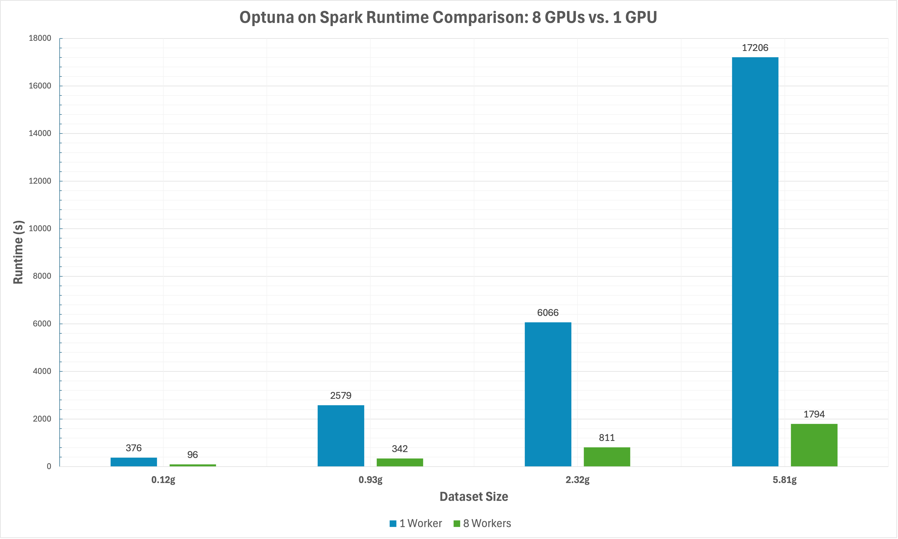

# Distributed Hyperparameter Tuning

These examples demonstrate distributed hyperparameter tuning with [Optuna](https://optuna.readthedocs.io/en/stable/index.html) on Apache Spark, accelerated with [RAPIDS](https://rapids.ai/) on GPU. We showcase how to set up and tune XGBoost on GPU, with deployment on Spark Standalone or Databricks clusters. 

## Contents:
- [Overview](#overview)
  - [Examples](#examples)
- [Running Optuna on Spark Standalone](#running-optuna-on-spark-standalone)
  - [Setup Database for Optuna](#1-setup-database-for-optuna)
  - [Setup Optuna Python Environment](#2-setup-optuna-python-environment)
  - [Start Standalone Cluster and Run](#3-start-standalone-cluster-and-run)
- [Running Optuna on Databricks](#running-optuna-on-databricks)
  - [Upload Init Script and Notebook](#1-upload-init-script-and-notebook)
  - [Create Cluster](#2-create-cluster)
  - [Run Notebook](#3-run-notebook)
- [Benchmarks](#benchmarks)
- [How Does it Work?](#how-does-it-work)
  - [Implementation Notes](#implementation-notes)

---

## Overview

Optuna is a lightweight Python library for hyperparameter tuning, integrating state-of-the-art hyperparameter optimization algorithms.  

At a high level, we optimize hyperparameters in three steps:
1. Wrap model training with an `objective` function that returns a loss metric.
2. In each `trial`, suggest hyperparameters based on previous results.
3. Create a `study` object, which executes the optimization and stores the trial results.

**Local example**: tuning XGBoost with Optuna (from [Optuna docs](https://optuna.org/#code_examples)):
```python
import xgboost as xgb
import optuna

# 1. Define an objective function to be maximized.
def objective(trial):
    ...

    # 2. Suggest values of the hyperparameters using a trial object.
    param = {
        "objective": "binary:logistic",
        "booster": trial.suggest_categorical("booster", ["gbtree", "gblinear", "dart"]),
        "lambda": trial.suggest_float("lambda", 1e-8, 1.0, log=True),
        "alpha": trial.suggest_float("alpha", 1e-8, 1.0, log=True),
        "subsample": trial.suggest_float("subsample", 0.2, 1.0),
        "colsample_bytree": trial.suggest_float("colsample_bytree", 0.2, 1.0),
    }

    booster = xgb.train(param, dtrain)
    ...
    return accuracy

# 3. Create a study object and optimize the objective function.
study = optuna.create_study(direction='maximize')
study.optimize(objective, n_trials=100)
```

To run **distributed tuning** on Spark, we take the following steps:
1. Each worker receives a copy of the same dataset. 
2. Each worker runs a subset of the trials in parallel.
3. Workers write trial results and receive new hyperparameters using a shared database. 

### Examples

We provide **2 notebooks**, with differences in the backend/implementation. See [implementation notes](#implementation-notes) for more details.

- `optuna-joblibspark.ipynb`: 
  - Uses the [Joblib Spark backend](https://github.com/joblib/joblib-spark) to distribute tasks on the Spark cluster.
  - Implements *Worker-I/O*, where each worker reads the full dataset from a specified filepath (e.g., distributed file system).
  - Builds on [this Databricks example](https://docs.databricks.com/en/machine-learning/automl-hyperparam-tuning/optuna.html). 
- `optuna-dataframe.ipynb`: 
  - Uses Spark dataframes to distribute tasks on the cluster. 
  - Implements *Spark-I/O*, where Spark reads the dataset from a specified filepath, then duplicates and repartitions it so that each worker task is mapped onto a copy of the dataset.
  - Dataframe operations are accelerated on GPU with the [Spark-RAPIDS Accelerator](https://nvidia.github.io/spark-rapids/).

## Running Optuna on Spark Standalone

### 1. Setup Database for Optuna

Optuna offers an RDBStorage option which allows for the persistence of experiments across different machines and processes, thereby enabling Optuna tasks to be distributed.

This section will walk you through setting up MySQL as the backend for RDBStorage in Optuna.

We highly recommend installing MySQL on the driver node. This setup eliminates concerns regarding MySQL connectivity between worker nodes and the driver, simplifying the management of database connections.  
(For Databricks, the installation is handled by the init script).

1. Install MySql:

``` shell
sudo apt install mysql-server
```

2. Configure MySQL bind address:

in `/etc/mysql/mysql.conf.d/mysqld.cnf`

``` shell
bind-address    = YOUR_DRIVER_HOST_IP
mysqlx-bind-address = YOUR_DRIVER_HOST_IP
```

3. Restart MySQL:

``` shell
sudo systemctl restart mysql.service
```

4. Setup user:

```shell
sudo mysql
```

``` mysql
mysql> CREATE USER 'optuna_user'@'%' IDENTIFIED BY 'optuna_password';
Query OK, 0 rows affected (0.01 sec)

mysql> GRANT ALL PRIVILEGES ON *.* TO 'optuna_user'@'%' WITH GRANT OPTION;
Query OK, 0 rows affected (0.01 sec)

mysql> FLUSH PRIVILEGES;
Query OK, 0 rows affected (0.01 sec)

mysql> EXIT;
Bye
```

Create a database for Optuna:

``` shell
mysql -u optuna_user -p -e "CREATE DATABASE IF NOT EXISTS optuna"
```

Troubleshooting:  
> If you encounter   
`"ERROR 2002 (HY000): Can't connect to local MySQL server through socket '/tmp/mysql.sock' (2)"`,  
try the command:  
`ln -s /var/run/mysqld/mysqld.sock /tmp/mysql.sock`

### 2. Setup Optuna Python Environment

Install the MySQL client and create a conda environment with the required libraries.  
We use [RAPIDS](https://docs.rapids.ai/install/#get-rapids) for GPU-accelerated ETL. See the [docs](https://docs.rapids.ai/install/#get-rapids) for version selection.
``` shell
sudo apt install libmysqlclient-dev

conda create -n rapids-25.10 -c rapidsai -c conda-forge -c nvidia  \
    cudf=25.10 cuml=25.10 python=3.10 'cuda-version>=12.0,<=12.5'
conda activate optuna-spark
pip install mysqlclient
pip install optuna joblib joblibspark ipywidgets
```

### 3. Start Standalone Cluster and Run

Configure your standalone cluster settings. 
This example just creates local cluster with a single GPU worker:
```shell
export SPARK_HOME=/path/to/spark
export SPARK_WORKER_OPTS="-Dspark.worker.resource.gpu.amount=1  \
    -Dspark.worker.resource.gpu.discoveryScript=$SPARK_HOME/examples/src/main/scripts/getGpusResources.sh"
export MASTER=spark://$(hostname):7077; export SPARK_WORKER_INSTANCES=1; export CORES_PER_WORKER=8

${SPARK_HOME}/sbin/start-master.sh; ${SPARK_HOME}/sbin/start-worker.sh -c ${CORES_PER_WORKER} -m 16G ${MASTER}
```

You can now run the notebook using the `optuna-spark` Python kernel!  
The notebook contains instructions to attach to the standalone cluster.


## Running Optuna on Databricks

### 1. Upload Init Script and Notebook

- Make sure your [Databricks CLI]((https://docs.databricks.com/en/dev-tools/cli/tutorial.html)) is configured for your Databricks workspace.
- Copy the desired notebook into your Databricks workspace. For example:
    ```shell
    databricks workspace import /Users/someone@example.com/optuna/optuna-joblibspark.ipynb --format JUPYTER --file optuna-joblibspark.ipynb
    ```
- Copy the init script ```databricks/init_optuna.sh```:
    ```shell
    databricks workspace import /Users/someone@example.com/optuna/init_optuna.sh --format AUTO --file databricks/init_optuna.sh
    ```

### 2. Create Cluster

*For Databricks Azure*: Use the cluster startup script, which is configured to create a 4 node GPU cluster:
```shell
export INIT_PATH=/Users/someone@example.com/optuna/init_optuna.sh
cd databricks
chmod +x start_cluster.sh
./start_cluster.sh
```

Or, create a cluster via the web UI:
- Go to `Compute > Create compute` and set the desired cluster settings.    
- Under `Advanced Options > Init Scripts`, upload the init script from your workspace.
- Under `Advanced Options > Spark > Environment variables`, set `LIBCUDF_CUFILE_POLICY=OFF`.
- Make sure to use a GPU cluster and include task GPU resources.

The init script will install the required libraries on all nodes, including RAPIDS and the Spark-RAPIDS plugin for GPU-accelerated ETL. On the driver, it will setup the MySQL server backend. 

### 3. Run Notebook

Locate the notebook in your workspace and click on `Connect` to attach it to the cluster. The notebook is ready to run!

## Benchmarks

The graph below shows running times comparing distributed (8 GPUs) vs. single GPU hyperparameter tuning with 100 trials on synthetic regression datasets.  



## How does it work?

The Optuna tasks will be serialized into bytes and distributed to Spark workers to run. The Optuna task on the executor side that loads the Optuna study from RDBStorage, and then runs its set of trials.

During tuning, the Optuna tasks send intermediate results back to RDBStorage to persist, and ask for the parameters from RDBStorage sampled by Optuna on the driver to run next.

**Using JoblibSpark**: each Optuna task is a Spark application that has only 1 job, 1 stage, 1 task, and the Spark application will be submitted on the local threads. Here the parameter `n_jobs` configures the Spark backend to limit how many Spark applications are submitted at the same time.  

Thus Optuna with JoblibSpark uses Spark application level parallelism, rather than task-level parallelism. For larger datasets, ensure that a single XGBoost task can run on a single node without any CPU/GPU OOM.  

Application parallelism with JoblibSpark:  


### Implementation Notes

###### Data I/O:
Since each worker requires the full dataset to perform hyperparameter tuning, there are two strategies to get the data into worker memory:
  - **Worker I/O**: *each worker reads the dataset* from the filepath once the task has begun. In practice, this requires the dataset to be written to a distributed file system accessible to all workers prior to tuning. The `optuna-joblibspark` notebook demonstrates this.
  - **Spark I/O**: Spark reads the dataset and *creates a copy of the dataset for each worker*, then maps the tuning task onto each copy. In practice, this enables the code to be chained to other Dataframe operations (e.g. ETL stages) without the intermediate step of writing to DBFS, at the cost of some overhead during duplication. The `optuna-dataframe` notebook demonstrates this.
    - To achieve this, we coalesce the input Dataframe to a single partition, and recursively self-union until we have the desired number of copies (number of workers). Thus each partition will contain a duplicate of the entire dataset, and the Optuna task can be mapped directly onto the partitions.


###### Misc:
- Please be aware that Optuna studies will continue where they left off from previous trials; delete and recreate the study if you would like to start anew.
- Optuna in distributed mode is **non-deterministic** (see [this link](https://optuna.readthedocs.io/en/stable/faq.html#how-can-i-obtain-reproducible-optimization-results)), as trials are executed asynchronously by executors. Deterministic behavior can be achieved using Spark barriers to coordinate reads/writes to the database.
- Reading data with GPU using cuDF requires disabling [GPUDirect Storage](https://docs.rapids.ai/api/cudf/nightly/user_guide/io/io/#magnum-io-gpudirect-storage-integration), i.e., setting the environment variable `LIBCUDF_CUFILE_POLICY=OFF`, to be compatible with the Databricks file system. Without GDS, cuDF will use a CPU bounce buffer when reading files, but all parsing and decoding will still be accelerated by the GPU. 
- Note that the storage doesn’t store the state of the instance of samplers and pruners. To resume a study with a sampler whose seed argument is specified, [the sampler can be pickled](https://optuna.readthedocs.io/en/stable/tutorial/20_recipes/001_rdb.html#resume-study) and returned to the driver alongside the results. 
