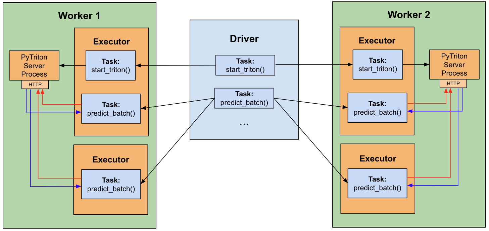

# Deep Learning Inference on Spark

Example notebooks demonstrating **distributed deep learning inference** using the [predict_batch_udf](https://developer.nvidia.com/blog/distributed-deep-learning-made-easy-with-spark-3-4/#distributed_inference) introduced in Spark 3.4.0.
These notebooks also demonstrate integration with [Triton Inference Server](https://docs.nvidia.com/deeplearning/triton-inference-server/user-guide/docs/index.html), an open-source, GPU-accelerated serving solution for DL.

## Contents:
- [Overview](#overview)
- [Running Locally](#running-locally)
- [Running on Cloud](#running-on-cloud-environments)
- [Integration with Triton Inference Server](#inference-with-triton)

## Overview

These notebooks demonstrate how models from external frameworks (Torch, Huggingface, Tensorflow) trained on single-worker machines can be used for large-scale distributed inference on Spark clusters.  
For example, a basic model trained in TensorFlow and saved on disk as "mnist_model" can be used in Spark as follows:
```
import numpy as np
from pyspark.sql.functions import predict_batch_udf
from pyspark.sql.types import ArrayType, FloatType

def predict_batch_fn():
    import tensorflow as tf
    model = tf.keras.models.load_model("/path/to/mnist_model")
    def predict(inputs: np.ndarray) -> np.ndarray:
        return model.predict(inputs)
    return predict

mnist = predict_batch_udf(predict_batch_fn,
                          return_type=ArrayType(FloatType()),
                          batch_size=1024,
                          input_tensor_shapes=[[784]])

df = spark.read.parquet("mnist_data")
predictions = df.withColumn("preds", mnist("data")).collect()
```

In this simple case, the `predict_batch_fn` will use TensorFlow APIs to load the model and return a simple `predict` function.  The `predict_batch_udf` will handle the data conversion from Spark DataFrame columns into batched numpy inputs.


#### Notebook List

Below is a full list of the notebooks with links to the examples they are based on. All notebooks have been saved with sample outputs for quick browsing.  

|   | Framework  | Notebook Name | Description | Link
| ------------- | ------------- | ------------- | ------------- | ------------- 
| 1 | PyTorch | Image Classification | Training a model to predict clothing categories in FashionMNIST, including accelerated inference with Torch-TensorRT. | [Link](https://pytorch.org/tutorials/beginner/basics/quickstart_tutorial.html)
| 2 | PyTorch | Housing Regression | Training a model to predict housing prices in the California Housing Dataset, including accelerated inference with Torch-TensorRT. | [Link](https://github.com/christianversloot/machine-learning-articles/blob/main/how-to-create-a-neural-network-for-regression-with-pytorch.md)
| 3 | Tensorflow | Image Classification | Training a model to predict hand-written digits in MNIST. | [Link](https://github.com/tensorflow/docs/blob/master/site/en/tutorials/keras/save_and_load.ipynb)
| 4 | Tensorflow | Keras Preprocessing | Training a model with preprocessing layers to predict likelihood of pet adoption in the PetFinder mini dataset. | [Link](https://github.com/tensorflow/docs/blob/master/site/en/tutorials/structured_data/preprocessing_layers.ipynb)
| 5 | Tensorflow | Keras Resnet50 | Training ResNet-50 to perform flower recognition from flower images. | [Link](https://docs.databricks.com/en/_extras/notebooks/source/deep-learning/keras-metadata.html)
| 6 | Tensorflow | Text Classification | Training a model to perform sentiment analysis on the IMDB dataset. | [Link](https://github.com/tensorflow/docs/blob/master/site/en/tutorials/keras/text_classification.ipynb)
| 7+8 | HuggingFace | Conditional Generation | Sentence translation using the T5 text-to-text transformer for both Torch and Tensorflow. | [Link](https://huggingface.co/docs/transformers/model_doc/t5#t5) 
| 9+10 | HuggingFace | Pipelines | Sentiment analysis using Huggingface pipelines for both Torch and Tensorflow. | [Link](https://huggingface.co/docs/transformers/quicktour#pipeline-usage)
| 11 | HuggingFace | Sentence Transformers | Sentence embeddings using SentenceTransformers in Torch. | [Link](https://huggingface.co/sentence-transformers)

## Running Locally

To run the notebooks locally, please follow these instructions:

#### Create environment

Each notebook has a suffix `_torch` or `_tf` specifying the environment used.

**For PyTorch:**
```
conda create -n spark-dl-torch -c conda-forge python=3.11
conda activate spark-dl-torch
pip install -r torch_requirements.txt
```
**For TensorFlow:**
```
conda create -n spark-dl-tf -c conda-forge python=3.11
conda activate spark-dl-tf
pip install -r tf_requirements.txt
```

#### Start Cluster

For demonstration, these instructions just use a local Standalone cluster with a single executor, but they can be run on any distributed Spark cluster. For cloud environments, see [below](#running-on-cloud-environments).

```shell
# Replace with your Spark installation path
export SPARK_HOME=</path/to/spark>
```

```shell
# Configure and start cluster
export MASTER=spark://$(hostname):7077
export SPARK_WORKER_INSTANCES=1
export CORES_PER_WORKER=8
export SPARK_WORKER_OPTS="-Dspark.worker.resource.gpu.amount=1 -Dspark.worker.resource.gpu.discoveryScript=$SPARK_HOME/examples/src/main/scripts/getGpusResources.sh"
${SPARK_HOME}/sbin/start-master.sh; ${SPARK_HOME}/sbin/start-worker.sh -c ${CORES_PER_WORKER} -m 16G ${MASTER}
```

The notebooks are ready to run! Each notebook has a cell to connect to the standalone cluster and create a SparkSession.

**Notes**: 
- Please create separate environments for PyTorch and Tensorflow notebooks as specified above. This will avoid conflicts between the CUDA libraries bundled with their respective versions. 
- `requirements.txt` installs pyspark>=3.4.0. Make sure the installed PySpark version is compatible with your system's Spark installation.
- The notebooks require a GPU environment for the executors.  
- The PyTorch notebooks include model compilation and accelerated inference with TensorRT. While not included in the notebooks, Tensorflow also supports [integration with TensorRT](https://docs.nvidia.com/deeplearning/frameworks/tf-trt-user-guide/index.html), but as of writing it is not supported in TF==2.17.0. 
- Note that some Huggingface models may be gated and will require a login, e.g.,:
    ```python
    from huggingface_hub import login
    login()
    ```

**Troubleshooting:** 
If you encounter issues starting the Triton server, you may need to link your libstdc++ file to the conda environment, e.g.:
```shell
ln -sf /usr/lib/x86_64-linux-gnu/libstdc++.so.6 ${CONDA_PREFIX}/lib/libstdc++.so.6
```
If the issue persists with the message `libstdc++.so.6: version 'GLIBCXX_3.4.30' not found`, you may need to update libstdc++ in your conda environment:
```shell
conda install -c conda-forge libstdcxx-ng
```

## Running on Cloud Environments

We also provide instructions to run the notebooks on CSP Spark environments.  
See the instructions for [Databricks](databricks/README.md) and [GCP Dataproc](dataproc/README.md).

## Inference with Triton

The notebooks also demonstrate integration with the [Triton Inference Server](https://docs.nvidia.com/deeplearning/triton-inference-server/user-guide/docs/index.html), an open-source serving platform for deep learning models, which includes many [features and performance optimizations](https://docs.nvidia.com/deeplearning/triton-inference-server/user-guide/docs/index.html#triton-major-features) to streamline inference.  
The notebooks use [PyTriton](https://github.com/triton-inference-server/pytriton), a Flask-like Python framework that handles communication with the Triton server.  



The diagram above shows how Spark distributes inference tasks to run on the Triton Inference Server, with PyTriton handling request/response communication with the server. 

The process looks like this:
- Distribute a PyTriton task across the Spark cluster, instructing each worker to launch a Triton server process.
    - Use stage-level scheduling to ensure there is a 1:1 mapping between worker nodes and servers.
- Define a Triton inference function, which contains a client that binds to the local server on a given worker and sends inference requests.
- Wrap the Triton inference function in a predict_batch_udf to launch parallel inference requests using Spark.
- Finally, distribute a shutdown signal to terminate the Triton server processes on each worker.

For more information on how PyTriton works, see the [PyTriton docs](https://triton-inference-server.github.io/pytriton/latest/high_level_design/).