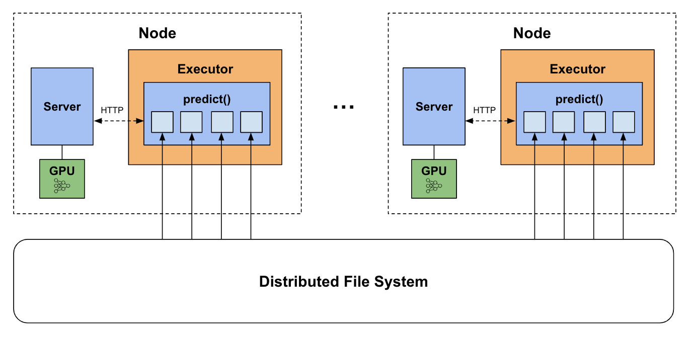

# Deep Learning Inference on Spark

Example notebooks demonstrating **distributed deep learning inference** using the [predict_batch_udf](https://developer.nvidia.com/blog/distributed-deep-learning-made-easy-with-spark-3-4/#distributed_inference) introduced in Spark 3.4.0.
These notebooks also demonstrate model serving integrations with [Triton Inference Server](https://docs.nvidia.com/deeplearning/triton-inference-server/user-guide/docs/index.html) and [vLLM serve](https://docs.vllm.ai/en/latest/serving/openai_compatible_server.html).

## Contents:
- [Overview](#overview)
- [Running Locally](#running-locally)
- [Running on Cloud](#running-on-cloud-environments)
- [Inference Serving Integration](#inference-serving)

## Overview

These notebooks demonstrate how models from external frameworks (Torch, Huggingface, Tensorflow, vLLM) trained on single-worker machines can be used for large-scale distributed inference on Spark clusters.  
For example, a basic model trained in TensorFlow and saved on disk as "mnist_model" can be used in Spark as follows:
```
import numpy as np
from pyspark.sql.functions import predict_batch_udf
from pyspark.sql.types import ArrayType, FloatType

def predict_batch_fn():
    import tensorflow as tf
    model = tf.keras.models.load_model("/path/to/mnist_model")
    def predict(inputs: np.ndarray) -> np.ndarray:
        return model.predict(inputs)
    return predict

mnist = predict_batch_udf(predict_batch_fn,
                          return_type=ArrayType(FloatType()),
                          batch_size=1024,
                          input_tensor_shapes=[[784]])

df = spark.read.parquet("mnist_data")
predictions = df.withColumn("preds", mnist("data")).collect()
```

In this simple case, the `predict_batch_fn` will use TensorFlow APIs to load the model and return a simple `predict` function.  The `predict_batch_udf` will handle the data conversion from Spark DataFrame columns into batched numpy inputs.


#### Notebook List

Below is a full list of the notebooks and their links. All notebooks have been saved with sample outputs for quick browsing.  

|   | Framework  | Notebook Name | Description | Link
| ------------- | ------------- | ------------- | ------------- | ------------- 
| 1 | HuggingFace | DeepSeek-R1 | LLM batch inference using the DeepSeek-R1-Distill-Llama reasoning model to solve word problems. | [Link](huggingface/deepseek-r1_torch.ipynb)
| 2 | HuggingFace | Qwen-2.5-7b | LLM batch inference using the Qwen-2.5-7b model for text summarization. | [Link](huggingface/qwen-2.5-7b_torch.ipynb)
| 3 | HuggingFace | Gemma-7b | LLM batch inference using the Google Gemma-7b model for code comprehension tasks. | [Link](huggingface/gemma-7b_torch.ipynb)
| 4 | HuggingFace | Sentence Transformers | Sentence embeddings using SentenceTransformers in Torch. | [Link](huggingface/sentence_transformers_torch.ipynb)
| 5+6 | HuggingFace | Conditional Generation | Sentence translation using the T5 text-to-text transformer (Torch and Tensorflow). | [Torch Link](huggingface/conditional_generation_torch.ipynb), [TF Link](huggingface/conditional_generation_tf.ipynb)
| 7+8 | HuggingFace | Pipelines | Sentiment analysis using Huggingface pipelines (Torch and Tensorflow). | [Torch Link](huggingface/pipelines_torch.ipynb), [TF Link](huggingface/pipelines_tf.ipynb)
| 9 | vLLM | Qwen-2.5-14b-tensor-parallel | Tensor-parallel LLM batch inference using the Qwen-2.5-14b model to summarize unstructured text data into a structured schema, using vLLM serve. | [Link](vllm/qwen-2.5-14b-tensor-parallel_vllm.ipynb)
| 10 | vLLM | Qwen-2.5-7b | LLM batch inference using the Qwen-2.5-7b model to summarize for text summarization, using vLLM serve. | [Link](vllm/qwen-2.5-7b_vllm.ipynb)
| 11 | PyTorch | Image Classification | Training a model to predict clothing categories in FashionMNIST, and deploying with Torch-TensorRT accelerated inference. | [Link](pytorch/image_classification_torch.ipynb)
| 12 | PyTorch | Housing Regression | Training and deploying a model to predict housing prices in the California Housing Dataset, and deploying with Torch-TensorRT accelerated inference. | [Link](pytorch/housing_regression_torch.ipynb)
| 13 | Tensorflow | Image Classification | Training and deploying a model to predict hand-written digits in MNIST. | [Link](tensorflow/image_classification_tf.ipynb)
| 14 | Tensorflow | Keras Preprocessing | Training and deploying a model with preprocessing layers to predict likelihood of pet adoption in the PetFinder mini dataset. | [Link](tensorflow/keras_preprocessing_tf.ipynb)
| 15 | Tensorflow | Keras Resnet50 | Deploying ResNet-50 to perform flower recognition from flower images. | [Link](tensorflow/keras_resnet50_tf.ipynb)
| 16 | Tensorflow | Text Classification | Training and deploying a model to perform sentiment analysis on the IMDB dataset. | [Link](tensorflow/text_classification_tf.ipynb)


## Running Locally

To run the notebooks locally, please follow these instructions:

#### Create environment

Each notebook has a suffix `_torch`, `_tf`, or `_vllm` specifying the environment used.

**For PyTorch:**
```
conda create -n spark-dl-torch -c conda-forge python=3.11
conda activate spark-dl-torch
conda install -c conda-forge libstdcxx-ng
pip install -r torch_requirements.txt
```
**For TensorFlow:**
```
conda create -n spark-dl-tf -c conda-forge python=3.11
conda activate spark-dl-tf
conda install -c conda-forge libstdcxx-ng
pip install -r tf_requirements.txt
```
**For vLLM:**
```
conda create -n spark-dl-vllm -c conda-forge python=3.11
conda activate spark-dl-vllm
pip install -r vllm_requirements.txt
```

#### Start Cluster

For demonstration, these instructions just use a local Standalone cluster with a single executor, but they can be run on any distributed Spark cluster. If you haven't already, [install Spark](https://spark.apache.org/downloads.html) on your system. 
```shell
# Replace with your Spark installation path
export SPARK_HOME=</path/to/spark>
```

```shell
# Configure and start cluster
export MASTER=spark://$(hostname):7077
export SPARK_WORKER_INSTANCES=1
export CORES_PER_WORKER=8
export SPARK_WORKER_OPTS="-Dspark.worker.resource.gpu.amount=1 \
                          -Dspark.worker.resource.gpu.discoveryScript=$SPARK_HOME/examples/src/main/scripts/getGpusResources.sh"
${SPARK_HOME}/sbin/start-master.sh; ${SPARK_HOME}/sbin/start-worker.sh -c ${CORES_PER_WORKER} -m 16G ${MASTER}
```

The notebooks are ready to run! Each notebook has a cell to connect to the standalone cluster and create a SparkSession.

**Notes**: 
- Please create separate environments for different frameworks as specified above. This will avoid conflicts between the CUDA libraries bundled with their respective versions. 
- `requirements.txt` installs pyspark>=3.4.0. Make sure the installed PySpark version is compatible with your system's Spark installation.
- The notebooks require an NVIDIA GPU on your system.  
- The PyTorch notebooks include model compilation and accelerated inference with TensorRT. While not included in the notebooks, Tensorflow also supports [integration with TensorRT](https://docs.nvidia.com/deeplearning/frameworks/tf-trt-user-guide/index.html), but as of writing it is not supported in TF==2.17.0. 
- Note that some Huggingface models may be gated and will require a login, e.g.,:
    ```python
    from huggingface_hub import login
    login()
    ```

## Running on Cloud Environments

We also provide instructions to run the notebooks on CSP Spark environments.  
See the instructions for [Databricks](databricks/README.md) and [GCP Dataproc](dataproc/README.md).

## Inference Serving



The notebooks demonstrate deploying models on an inference server as a sidecar process, as shown above. The process looks like this:
- Prior to inference, launch a server process on each node.
- Define a predict function, which creates a client that sends/receives inference requests to the local server.
- Wrap the predict function in a predict_batch_udf to launch parallel inference requests using Spark.

This logically separates the CPU parallelism from the GPU parallelism for streamlined deployment. 
For instance, say we want to run a 20GB model on a GPU with 25GB of memory.
- With `predict_batch_udf` using an in-process framework, we must set `spark.task.resource.gpu.amount=1`, which limits parallelism to 1 task (i.e. model instance) per GPU for the entire application due to memory constraints. 
- Using an inference server, we can set `spark.task.resource.gpu.amount=(num_cores)` to leverage all the executor CPUs for Dataframe operations (reading/preprocessing/writing), while the server loads 1 instance of the model on the GPU for inference.

See [`server_utils.py`](server_utils.py) for more details on how we manage servers on the Spark cluster.

### Triton Inference Server

Each notebook has a section that demonstrates model serving with [Triton Inference Server](https://docs.nvidia.com/deeplearning/triton-inference-server/user-guide/docs/index.html), an open-source serving platform for deep learning models, which includes many [major features](https://docs.nvidia.com/deeplearning/triton-inference-server/user-guide/docs/index.html#triton-major-features) to streamline inference. To leverage Triton through Python, we use [PyTriton](https://github.com/triton-inference-server/pytriton), a Flask-like framework that handles communication with the Triton server.  

Triton allows you to define a Python function encapsulating the inference logic, including complex pipelines such as model ensembles or concurrent execution. For more information on how PyTriton works, see the [PyTriton docs](https://triton-inference-server.github.io/pytriton/latest/high_level_design/).

### vLLM Server

The vLLM notebooks demonstrate serving with [vLLM serve](https://docs.vllm.ai/en/latest/serving/openai_compatible_server.html), an OpenAI-compatible HTTP server to deploy vLLM models. If you do not need the custom inference logic provided by Triton, vLLM serve is a straightforward alternative to deploy a vLLM-compatible LLM.