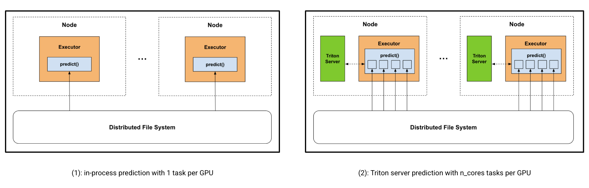

# Spark Batch Inference Benchmark

This folder contains the benchmark code to assess the benefits of Spark DL inference on Triton, comparing the following implementations:
1. Use predict_batch_udf to perform in-process prediction on the GPU.
2. Use predict_batch_udf to send inference requests to the Triton server, which handles inference on the GPU.

Spark cannot change the task parallelism within a stage based on the resources required (i.e., multiple CPUs for preprocessing vs. single GPU for inference). Therefore, implementation (1) will limit to 1 task per GPU to enable one instance of the model to occupy the GPU. In contrast, implementation (2) allows as many tasks to run in parallel as cores on the executor, while Triton will handle inference on the GPU.



### Setup

The workload consists of the following 4-step pipeline:
1. Read binary JPEG image data from parquet
2. Preprocess on CPU (decompress, resize, crop, normalize)
3. Inference on GPU
4. Write results to parquet


We used the [ImageNet 2012](https://image-net.org/challenges/LSVRC/2012/2012-downloads.php#Images) validation dataset containing 50,000 images, and a pre-trained [PyTorch ResNet-50](https://pytorch.org/vision/main/models/generated/torchvision.models.resnet50.html) model for classification. We used the [`prepare_dataset.py`](prepare_dataset.py) script to load and prepare the ImageNet data into a binary parquet format to be read with Spark.

### Environment

We used the `spark-dl-torch` conda environment, setup following the [README](../README.md#create-environment).
We tested on a local standalone cluster with 1 executor: 1 A6000 GPU, 16 cores, and 32GB of memory. The cluster can be started like so:
```shell
conda activate spark-dl-torch
export SPARK_HOME=</path/to/spark>
export MASTER=spark://$(hostname):7077
export SPARK_WORKER_INSTANCES=1
export CORES_PER_WORKER=16
export SPARK_WORKER_OPTS="-Dspark.worker.resource.gpu.amount=1 \
                          -Dspark.worker.resource.gpu.discoveryScript=$SPARK_HOME/examples/src/main/scripts/getGpusResources.sh"
${SPARK_HOME}/sbin/start-master.sh; ${SPARK_HOME}/sbin/start-worker.sh -c ${CORES_PER_WORKER} -m 32G ${MASTER}
```

The Spark configurations used for the two implementations can be found under the launch script [`run_bench_spark_resnet.sh`](run_bench_spark_resnet.sh). The only differences are in the task parallelism, i.e. `spark.task.resource.gpu.amount` and `spark.task.cpus`.

### Running the Benchmark

The script can be run like so:
```shell
# Implementation 1 - in-process prediction 
./run_bench_spark_resnet.sh -t base
# Implementation 2 - Triton server prediction
./run_bench_spark_resnet.sh -t triton
```
The batch size used in `predict_batch_udf` can be configured with `-b batch_size`. Note this corresponds to different things in the two implementations: in implementation 1, this is the batch size used in the model, and in implementation 2, this is the client's batch size in each inference request, which may be dynamically batched by the server. 

By default, we use `-b 1024` for the base implementation, and `-b 256` for Triton with a server-side max batch size of 1024. We experimented with other batch sizes (e.g., smaller in-process batch sizes and larger client-side batch sizes for Triton), but these defaults gave the best results for both.

### Results

End-to-end throughput of the two implementations (higher is better):

