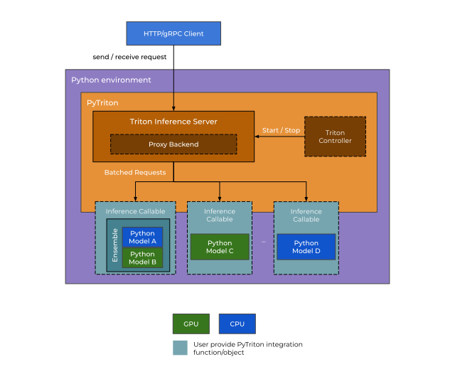

# Spark DL Inference on Databricks

Distributed deep learning inference using the PySpark [predict_batch_udf](https://spark.apache.org/docs/latest/api/python/reference/api/pyspark.ml.functions.predict_batch_udf.html#pyspark.ml.functions.predict_batch_udf) function on Databricks.  
Also demonstrates integration with [Triton Inference Server](https://developer.nvidia.com/nvidia-triton-inference-server), an open-source, GPU-accelerated serving solution for DL. 

## Setup

1. Install latest [databricks-cli](https://docs.databricks.com/en/dev-tools/cli/tutorial.html) and configure for your workspace.

2. Specify the destination filepaths on Databricks:
    The notebook and init script will be imported to your workspace, and the requirements to DBFS.
    ```shell
    export NOTEBOOK_PATH=</path/in/workspace/to/conditional_generation.ipynb>
    export INIT_PATH=</path/in/workspace/to/init_spark_dl.sh>
    export REQ_PATH=<dbfs:/path/to/requirements.txt>
    ```

3. `cd` into the [setup directory](setup).

4. Run the setup script, which will copy files to Databricks: 
    ```shell
    chmod +x setup.sh
    ./setup.sh
    ```

5. Launch the cluster with the provided script (defaults to 8 node GPU cluster):
    ```shell
    chmod +x start_cluster.sh
    ./start_cluster.sh
    ```

    OR, start the cluster from the Databricks UI:  

    - Go to `Compute > Create compute` and set the desired cluster settings.
        - Integration with Triton inference server uses stage-level scheduling. Make sure to:
            - use a cluster with GPU resources
            - set a value for `spark.executor.cores`
            - ensure that `spark.executor.resource.gpu.amount` = 1
    - Under `Advanced Options > Init Scripts`, upload the init script from your workspace.

6. Navigate to the notebook in your Databricks workspace. Attach the notebook to the cluster and run the cells interactively.  

## Inference with PyTriton 


The diagram above demonstrates how Spark distributes inference tasks to run on the [Triton Inference Server](https://developer.nvidia.com/nvidia-triton-inference-server), with PyTriton handling request/response communication with the server.  

The process looks like this:
- Distribute a PyTriton task across the Spark cluster, instructing each node to launch a Triton server process.
    - Use stage-level scheduling to ensure each node is assigned a single startup task.
- Define a Triton inference function, which contains a client that binds to the local server on a given node and sends inference requests.
- Wrap the Triton inference function in a predict_batch_udf to launch parallel inference requests using Spark.
- Finally, distribute a shutdown signal to terminate the Triton server processes on each node.

Here is the high-level design of the PyTriton process (from [PyTriton docs](https://triton-inference-server.github.io/pytriton/latest/high_level_design/)):  

