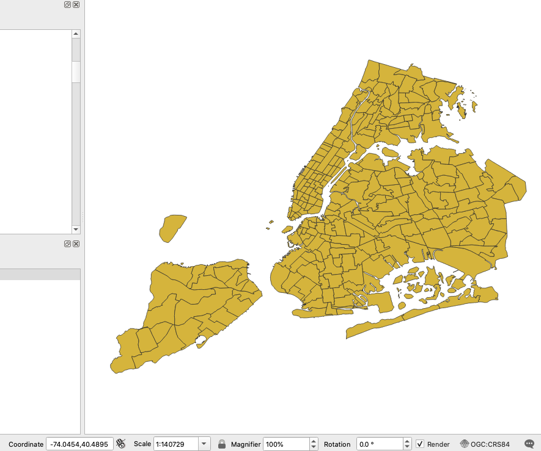
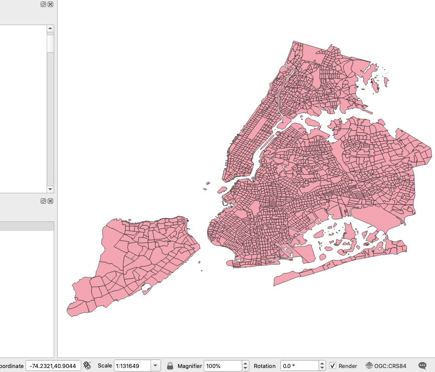
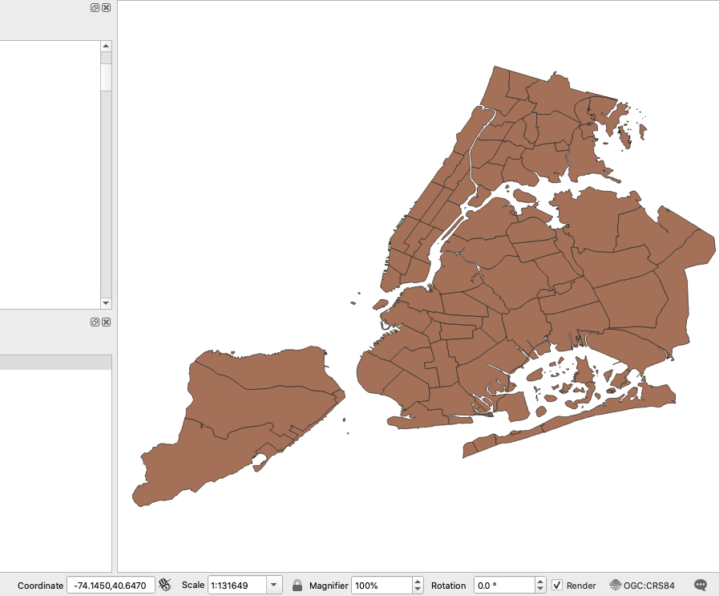
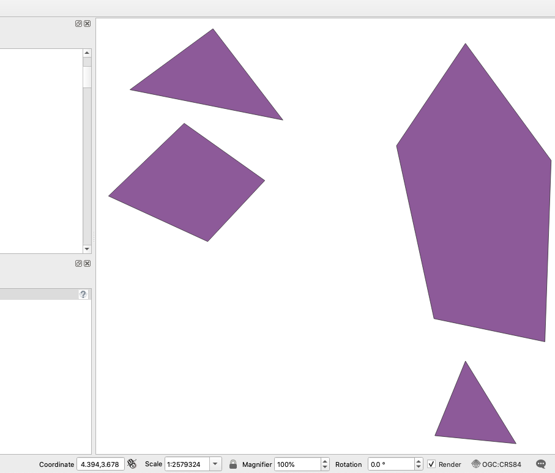
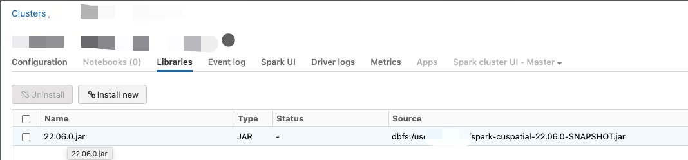

# Spark-cuSpatial

This is a Spark RapidsUDF application to illustrate how to use [cuSpatial](https://github.com/rapidsai/cuspatial) to solve a point-in-polygon problem.
It implements a [RapidsUDF](https://nvidia.github.io/spark-rapids/docs/additional-functionality/rapids-udfs.html#adding-gpu-implementations-to-udfs) 
interface to call the cuSpatial functions through JNI. It can be run on a distributed Spark cluster with scalability.

## Performance
We got the end-2-end hot run times as below table when running with 2009 NYC Taxi trip pickup location,
which includes 170,896,055 points, and 3 sets of polygons(taxi_zone, nyct2000, nycd Community-Districts).
The point data can be downloaded from [TLC Trip Record Data](https://www1.nyc.gov/site/tlc/about/tlc-trip-record-data.page).
The polygon data can be downloaded from [taxi_zone dataset](https://data.cityofnewyork.us/Transportation/NYC-Taxi-Zones/d3c5-ddgc),
[nyct2000 dataset](https://data.cityofnewyork.us/City-Government/2000-Census-Tracts/ysjj-vb9j) and 
[nycd Community-Districts dataset](https://data.cityofnewyork.us/City-Government/Community-Districts/yfnk-k7r4)

| Environment | Taxi_zones (263 Polygons) | Nyct2000 (2216 Polygons) | Nycd Community-Districts (71 Complex Polygons)|
| ----------- | :---------: | :---------: | :---------: |
| 4-core CPU | 3.9 minutes | 4.0 minutes| 4.1 minutes |
| 1 GPU(T4) on Databricks | 25 seconds | 27 seconds | 28 seconds|
| 2 GPU(T4) on Databricks | 15 seconds | 14 seconds | 17 seconds |
| 4 GPU(T4) on Databricks | 11 seconds | 11 seconds | 12 seconds |

Note: Please update the `x,y` column names to `Start_Lon,Start_Lat` in
the [notebook](./notebooks/cuspatial_sample_db.ipynb) if you test with the download points.
This demo could only work with v23.02.0 version or previous.

taxi-zones map:



nyct2000 map:



nyct-community-districts map:



## Build
Firstly build the UDF JAR from source code before running this demo.
You can build the JAR [in Docker](#build-in-docker) with the provided [Dockerfile](Dockerfile), 
or [in local machine](#build-in-local-machine) after prerequisites.

### Build in Docker
1. Build the docker image [Dockerfile](Dockerfile), then run the container.
     ```Bash
     docker build -f Dockerfile . -t build-spark-cuspatial
     docker run -it build-spark-cuspatial bash
     ```
2. Bash into the Docker and install libcuspatial
     ```Bash
     conda install -c rapidsai-nightly -c nvidia -c conda-forge -c defaults libcuspatial=23.02
     ```
3. Get the code, then run `mvn package`.
     ```Bash
     git clone https://github.com/NVIDIA/spark-rapids-examples.git
     cd spark-rapids-examples/examples/UDF-Examples/Spark-cuSpatial/
     mvn package
     ```
4. You'll get the jar named `spark-cuspatial-<version>.jar` in the target folder.

Note: The docker env is just for building the jar, not for running the application.

### Build in local machine:
1. Essential build tools:
    - [cmake(>=3.20)](https://cmake.org/download/),
    - [ninja(>=1.10)](https://github.com/ninja-build/ninja/releases),
    - [gcc(>=9.3)](https://gcc.gnu.org/releases.html)
2. [CUDA Toolkit(>=11.0)](https://developer.nvidia.com/cuda-toolkit)
3. conda: use [miniconda](https://docs.conda.io/en/latest/miniconda.html) to maintain header files and cmake dependecies
4. [cuspatial](https://github.com/rapidsai/cuspatial): install libcuspatial
    ```Bash
    # Install libcuspatial from conda
    conda install -c rapidsai-nightly -c nvidia -c conda-forge -c defaults libcuspatial=23.02
    ```
5. Build the JAR using `mvn package`.
     ```Bash
     git clone https://github.com/NVIDIA/spark-rapids-examples.git
     cd spark-rapids-examples/examples/Spark-cuSpatial/
     mvn package
     ```
6. `spark-cuspatial-<version>.jar` will be generated in the target folder.

## Run
### GPU Demo on Spark Standalone on-premises cluster
1. Set up [a standalone cluster](/docs/get-started/xgboost-examples/on-prem-cluster/standalone-scala.md) of Spark. Make sure the conda/lib is included in LD_LIBRARY_PATH, so that spark executors can load libcuspatial.so.

2. Download Spark RAPIDS JAR
   * [Spark RAPIDS JAR v23.02.0](https://repo1.maven.org/maven2/com/nvidia/rapids-4-spark_2.12/23.02.0/rapids-4-spark_2.12-23.02.0.jar) or above
3. Prepare sample dataset and JARs. Copy the [sample dataset](../../../datasets/cuspatial_data.tar.gz) to `/data/cuspatial_data/`.
    Copy Spark RAPIDS JAR and `spark-cuspatial-<version>.jar` to `/data/cuspatial_data/jars/`.
    If you build the `spark-cuspatial-<version>.jar` in docker, please copy the jar from docker to local:
    ```
    docker cp YOUR_DOCKER_CONTAINER:/PATH/TO/spark-cuspatial-<version>.jar ./YOUR_LOCAL_PATH
    ```
    Note: update the paths in `gpu-run.sh` accordingly.
4. Run `gpu-run.sh`
    ```Bash
    ./gpu-run.sh
    ```
### GPU Demo on AWS Databricks
1. Build a customized docker image using [Dockerfile.awsdb](Dockerfile.awsdb) and push to a Docker registry such as [Docker Hub](https://hub.docker.com/) which can be accessible by AWS Databricks.
     ```Bash
     # replace your dockerhub repo, your tag or any other repo AWS DB can access
     docker build -f Dockerfile.awsdb . -t <your-dockerhub-repo>:<your-tag>
     docker push <your-dockerhub-repo>:<your-tag>
     ```
 
2. Follow the [Spark-rapids get-started document](https://docs.nvidia.com/spark-rapids/user-guide/latest/getting-started/databricks.html) to create a GPU cluster on AWS Databricks.
 Below are some different steps since a custom docker image is used with Databricks:
    * Databricks Runtime Version
  Choose a non-ML Databricks Runtime such as `Runtime: 9.1 LTS(Scala 2.12, Spark 3.1.2)` and
  choose GPU AWS instance type such as `g4dn.xlarge`. Note that ML runtime does not support customized docker container with below messages:
`Support for Databricks container services requires runtime version 5.3+` 
  and the `Confirm` button is disabled.
    * Use your own Docker container
  Input `Docker Image URL` as `your-dockerhub-repo:your-tag`
    * Follow the Databricks get-started document for other steps.

3. Copy the sample [cuspatial_data.tar.gz](../../../datasets/cuspatial_data.tar.gz) or your data to DBFS by using Databricks CLI.
    ```Bash
    # extract the data
    tar zxf cuspatial_data.tar.gz
    databricks fs cp -r cuspatial_data/* dbfs:/data/cuspatial_data/
    databricks fs ls dbfs:/data/cuspatial_data/
    # it should have below 2 folders.
        points
        polygons
    ```
   The sample points and polygons are randomly generated.
   
   Sample polygons: 

   
   
4. Upload `spark-cuspatial-<version>.jar` on dbfs and then install it in Databricks cluster.
   
       

5. Import [cuspatial_sample.ipynb](notebooks/cuspatial_sample_db.ipynb) to Databricks workspace, attach it to Databricks cluster and run it.

### CPU Demo on AWS Databricks
1. Create a Databricks cluster. For example, Databricks Runtime 10.3.

2. Install the Sedona jars and Sedona Python libs on Databricks using web UI. 
   The Sedona version should be 1.1.1-incubating or higher.
   * Install below jars from Maven Coordinates in Libraries tab:
    ```Bash
    org.apache.sedona:sedona-python-adapter-3.0_2.12:1.2.0-incubating
    org.datasyslab:geotools-wrapper:1.1.0-25.2
    ```
   * To enable python support, install below python lib from PyPI in Libraries tab 
    ```Bash
    apache-sedona
    ```
3. From your cluster configuration (Cluster -> Edit -> Configuration -> Advanced options -> Spark) activate the 
   Sedona functions and the kryo serializer by adding below to the Spark Config
    ```Bash
    spark.sql.extensions org.apache.sedona.viz.sql.SedonaVizExtensions,org.apache.sedona.sql.SedonaSqlExtensions
    spark.serializer org.apache.spark.serializer.KryoSerializer
    spark.kryo.registrator org.apache.sedona.core.serde.SedonaKryoRegistrator
    ```
   
4. Upload the sample data files to DBFS, start the cluster, attach the [notebook](notebooks/spacial-cpu-apache-sedona_db.ipynb) to the cluster, and run it.
