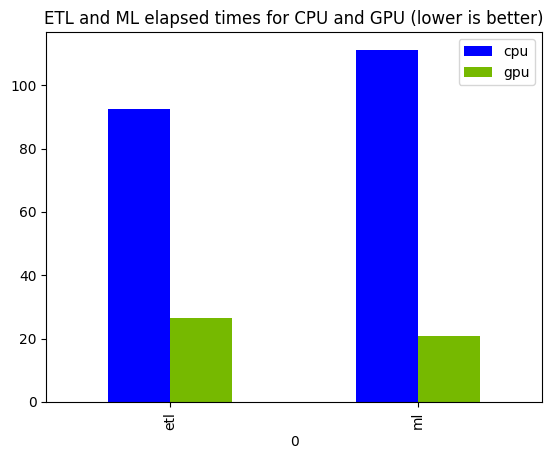

# Demo Notebook Overview

The `spark-connect-gpu-etl-ml.ipynb` notebook demonstrates:

## ETL Pipeline
- **Data ingestion** from CSV with custom schema
- **Complex transformations** including date parsing and delinquency calculations
- **String-to-numeric encoding** for categorical features
- **Data joins and aggregations** with mortgage performance data

## Machine Learning Workflow
- **Feature engineering** with FeatureHasher and VectorAssembler
- **Logistic Regression** training for multi-class prediction
- **Model evaluation** with performance metrics
- **GPU vs CPU timing comparisons**

## Key Code Examples

**Connecting to Spark with GPU acceleration:**
```python
from pyspark.sql import SparkSession

spark = (
  SparkSession.builder
    .remote('sc://spark-connect-server')
    .appName('GPU-Accelerated-ETL-ML-Demo')
    .getOrCreate()
)
```

In the actual demo code we find it handier to use the `SPARK_REMOTE` environment variable instead
of having it in the code
so it is easy to run it in a Spark Classic way as well.

**Machine Learning with GPU acceleration:**
```python
from pyspark.ml import Pipeline
from pyspark.ml.classification import LogisticRegression
from pyspark.ml.feature import VectorAssembler, FeatureHasher

spark.conf.set('spark.connect.ml.backend.classes', 'com.nvidia.rapids.ml.Plugin')

# Feature preparation
hasher = FeatureHasher(inputCols=categorical_cols, outputCol='hashed_categorical')
assembler = VectorAssembler().setInputCols(numerical_cols + ['hashed_categorical']).setOutputCol('features')

# Model training
logistic = LogisticRegression().setFeaturesCol('features').setLabelCol('delinquency_12')
pipeline = Pipeline().setStages([hasher, assembler, logistic])
model = pipeline.fit(training_data)
```

## Results

The demo at the Data+AI Summit'25 used the following mortgage quarters

```bash
$ du -h *
503M    2023Q1.csv
412M    2023Q2.csv
162M    2023Q3.csv
1.1G    2023Q4.csv
```

and was tested on a machine with a 6GiB RTX A3000 Laptop GPU

```bash
$ nvidia-smi
+-----------------------------------------------------------------------------------------+
| NVIDIA-SMI 560.35.05              Driver Version: 560.35.05      CUDA Version: 12.6     |
|-----------------------------------------+------------------------+----------------------+
| GPU  Name                 Persistence-M | Bus-Id          Disp.A | Volatile Uncorr. ECC |
| Fan  Temp   Perf          Pwr:Usage/Cap |           Memory-Usage | GPU-Util  Compute M. |
|                                         |                        |               MIG M. |
|=========================================+========================+======================|
|   0  NVIDIA RTX A3000 Laptop GPU    Off |   00000000:01:00.0 Off |                  N/A |
| N/A   56C    P8             13W /   60W |    1353MiB /   6144MiB |      1%      Default |
|                                         |                        |                  N/A |
+-----------------------------------------+------------------------+----------------------+
```

and a 2x8-core CPU


